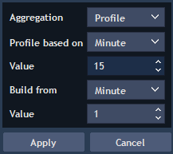
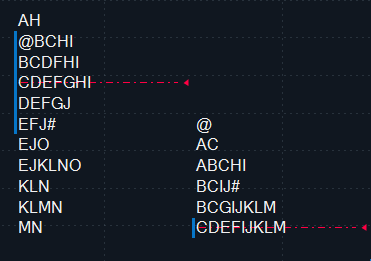
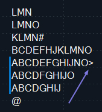

# Profile chart

Profile allows aggregating and plotting charts, where each bar is represented in the form of "market profile".

Market profile allows to organize data in the way that trader can understand who controls the market, what is meant by fair value, and what lies behind the price movement.

### 
**Algorithm of profile plotting**

When using market profile, the following method for plotting is applied: general time bars or tick bars which are displayed in the form of the column with Latin letters \(A, B..a, b..\) is the base for profile plotting. Bar open price is marked by special symbol – @, and bar close price – by \#.

### **Profile timeframe parameters**

Profile aggregation can be set via using the timeframe selector:

* Profile based on – allows to select base aggregation for chart plotting, available periods are: tick, second, minute, hour, day, week, month, year;
* Value – allows setting a value for selected period from "Profile based on" field;
* Build from – allows time period selection for chart plotting, available periods are: tick, second, minute, hour, day, week, month, year;
* Value – allows setting a value for selected period from "Build from" field.

**Important note:** "Build from" value must be less than "Profile based on" value. For example: Profile based on = 1H, Build from value = 5m.

### **Profile settings**

* Data type – the way to accept data. Available types are: Default by symbol, Bid, Ask, Last. Based on server settings Last or Bid/Ask type can be disabled;
* Font – allows selecting style of profile displaying;
* Point of control \(POC\) – defines the method of POC lines plotting.

Point of control \(POC\) – row with the largest number of letters – in fact, indicates the most common price. If there are several equal rows, the label is placed near that row which is closer to the center of the profile. The following options are possible:

1. None.
2. Line – line going through the POC level to the next profile.

3. Marker – POC line is allocated by the marker \(special symbol, for example &gt;\).

* Point of control style – allows to specify style of the selected POC type, available for "Point of control=Line" only;
* Value area – specifies the type of VA plotting.

Value area \(VA\) – characterizes the most common prices in the profile. Value area can be displayed in the form of vertical column to the left \(right\) of the profile, or in the form of the column with the respective horizontal top and bottom levels. Horizontal levels are held to the width of the current and the following historical profile. The following options are possible:

1. None;
2. Vertical – VA is plotted in the form of vertical line by the left border of the profile.
3. Horizontal – VA is plotted in the form of vertical line, as well as with two horizontal lines going to the next profile.
4. To next profile – VA is plotted in the form of vertical line, as well as with two horizontal lines that are plotted taking into account the next profile.

* Value, % – allows setting what part of the total number of letters \(TPO\) it is necessary to display;

TPO \(Time-Price opportunities\) – characterizes the total number of letters in the profile.

* Vertical line style – allows selecting style of vertical line plotting;
* Show singles, Singles style – controls the visibility and style of "single lines" plotting;

Singles – horizontal lines are displayed on the profile in those places, where there is a single letter in the middle of the profile.

* Color scheme, Color – allows selecting type and style of plotting the whole profile. The following coloring types are available:
  * Single color – all letters from the profile will be colored in single color;
  * Delta profile – difference between purchases and sales is calculated by the whole profile. All letters are colored in the appropriate color;
  * Delta price – coloring goes by rows, if price difference between purchases and sales is positive, then the whole row is colored in green, and if negative – in red color. The intensity of the color depends on the value of difference, the greater the difference, the brighter the color;
  * Delta bars – if difference between purchases and sales is positive in the current bar, then these letters are colored in green, if negative – in red color. The intensity of the color depends on the value of difference, the greater the difference, the brighter the color;
  * Up/Down profile – this coloring is similar to the bars coloring, selected colors correspond to the growing and falling bars for the entire profile;
  * Up/Down bars – this coloring is similar to the bars coloring, selected colors correspond to the growing and falling bars, this color scheme is applied to each bar included into profile;
  * Volume price – coloring goes by rows. All rows are colored in one color. The intensity of the color depends on trades quantity by the price;
  * Volume bars – all bars are colored in one color. The intensity of the color depends on trades quantity in the bar.

Note: relative and algorithmic price scales are not applied to this aggregation type.

