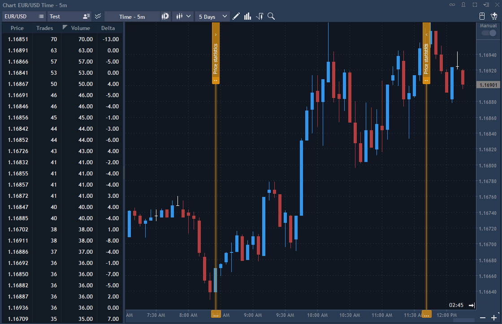
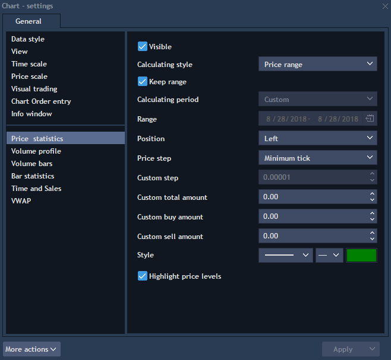

# Price statistics


This functionality allows aggregating volumes and derived values by each price level for a specified period of time. Price statistics is a table that appears on the left or right side of the chart depending on the selected position in the settings. Price table can be opened from the Analysis tools menu by clicking on the button
or through Context menu -&gt; Analysis tools  -&gt; Price statistics. 


**Note: to work correctly with the tools of analysis, except Volume bars, it is obligatory to have trade and tick history.**

By default statistics table contains four columns \(Price, Trades, Volume and Delta\), but it can be extended with additional parameters. The following parameters are available in the price statistics table:

* Price – all price levels for a specified period of time.
* Trades – the number of trades by each price level for a specified period of time.
* Volume – total volume by each price level for a specified period of time.
* Buy volume – total buy volume by each price level for a specified period of time.
* Sell volume – total sell volume by each price level for a specified period of time.
* Delta – shows difference between buy volume and sell volume for a specified period of time.

Delta = Buy volume – Sell volume

* Buy volume, % – total buy volume for a specified period of time expressed as a percentage.
* Sell volume, % – total sell volume for a specified period of time expressed as a percentage.
* Delta, % – Delta index expressed as a percentage. Delta, % = Buy volume, % – Sell volume, %
* Average size – shows average volume of one trade. Average size = Volume/Trades
* Custom total volume trades – this mode summarizes all trades which traded with volume greater than Amount \(set in settings\) and shows percentage of such trades in the total volume.

Custom total volume trades, % = Count \(Total volume &gt; Amount\)/ Total trades \* 100%

Amount = Custom total amount \(set in settings\)

* Custom buy volume trades – this mode summarizes all buy trades which traded with volume greater than Amount \(set in settings\) and shows percentage of such trades in the total buy volume.

Custom buy volume trades, % = Count \(Buy volume &gt; Amount\)/ Buy trades \* 100%

Amount = Custom buy amount \(set in settings\)

* Custom sell volume trades – this mode summarizes all sell trades which traded with volume greater than Amount \(set in settings\) and shows percentage of such trades in the total sell volume.

Custom sell volume trades, % = Count \(Sell volume &gt; Amount\)/ Sell trades \* 100%

Amount = Custom sell amount \(set in settings\)

* Reset defaults –​ allows to reset settings to defaults.

### **Settings**

* Visible – controls visibility of the price statistics on the chart.
* Calculating style – allows choosing method of the data range setting. Two modes are available here:
  * From period – if chosen, user specifies date range using options From date..To date \(Custom\) or chooses one of the predefined options.
  * Price range – if chosen, user specifies date range in the visual mode using two vertical lines.
* Keep range – if checked, the position of renderer \(two vertical lines used to specify the range\) in the 'Price range' mode will be saved relative to the axis X when switching the timeframe or changing the trading symbol. This setting is enabled only if 'Price range' mode is selected.
* Calculating period – is active, when 'From period' is chosen in the Calculating style field. Available options: custom, today, yesterday, current week, last week, current month and last month.
* Position – specifies position of the price statistics table relatively to the chart area \(Left or Right\).
* Price step – allows setting minimal distance between price levels. Two options are available:
  * Minimum tick – distance between price levels is equal to minimal tick.
  * Custom – allows specifying random distance between price levels. Custom &gt;=Minimum tick
* Custom total/buy/sell amount – allows setting amount that is necessary for calculation of the Custom total/buy/sell volume trades parameters \(described above\).
* Highlight price levels – if active, all chosen price levels in the statistics table \(use double click to select the level\) will be highlighted on the chart in the form of horizontal line with price.

### **Context menu**

* Add line – draws standard horizontal line on the chart by specified price level.
* Settings – evokes settings of the price statistics table.
* Export, Table alerts – standard settings of the context menu.

