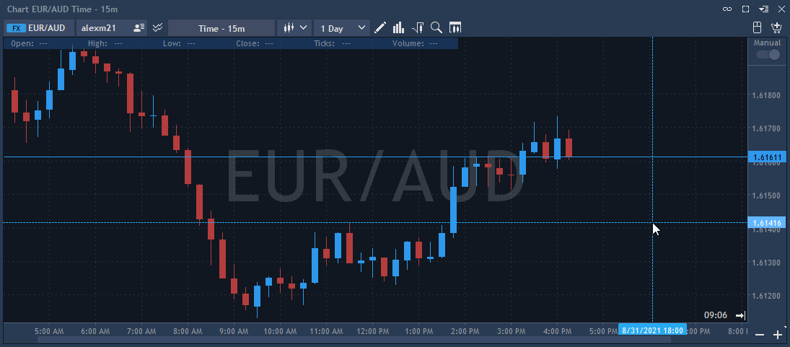

# Time & Sales analysis


This functionality allows analyzing tick history by each bar or by price range selected on the chart. Selected bar or price range should not exceed one day, otherwise – tick history will not be loaded. 

Time & Sales can be opened from the Analysis tools menu by clicking on the button 
or through Context menu -&gt; Analysis tools -&gt; T&S.


**To work correctly with the tools of analysis, except Volume bars, it is obligatory to have trade and tick history.**


Time & Sales functionality can be set in the following way:

* Visible – controls visibility of the T&S on the chart.
* Time & Sales mode – allows choosing mode of the data selection: single or price range.
  * Single mode – if chosen, user selects bar on the chart by which information about the trades will be shown.
  * Price range – if chosen, user specifies price range in the visual mode using two vertical lines.
* Keep range – if checked, the position of renderer \(two vertical lines used to specify the range\) in the 'Price range' mode will be saved relative to the axis X when switching the timeframe or changing the trading symbol. This setting is enabled only if 'Price range' mode is selected.
* Panel position – specifies position of the T&S table relatively to the chart area: right or left.


Time & Sales table chronologically shows all trades for a symbol by selected period. The following parameters are shown in the T&S table:

* Time – the time of the trade.
* Price – the price at which the trade fills.
* Size – the size of the trade.
* Source – the source of market data, where a trade took place.
* Side – shows side of the trade: Buy or Sell.

### **T & S settings:**

* Grid – allows to choose the grid type inside of T&S table: Vertical, Horizontal, Vertical & horizontal, None.
* Aggregation – if checked, all trades with the same price, side, size, and MPId in one row as total are shown. This is applied to the highly-liquid markets.
* Time format – the time of the trade, can be displayed in two modes depending on the time format set in the settings: hh:mm:ss or hh:mm:ss:ms.
* Autosize of columns – allows showing T&S table in auto size mode.
* Show size in – allows selecting in what form the volume will be shown. General defaults – is taken from general settings; Lots – will be displayed in lots; Real size - will be displayed in real value.
* Round precision – if checked, user can set the precision of the volume display.
* Colors – allows to choose the coloring scheme for table and prints.

