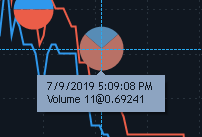

# Volume dots

Volume dots functionality allows plotting a real-time chart and showing volumes as 2D dots when 1 Tick aggregation method is selected for the chart. Volume dots functionality is also available for historical data.

Blue color of dots shows Buy volume, red color shows Sell volume.

To start displaying the Volume dots on the chart, a user needs to perform the following steps in the ‘Aggregation types’ window, selecting the Edit mode:

* Select the Tick aggregation type;
* Set the Value to “1”;
* Tick the ‘Volume dots’ checkbox (unchecked by default).


The plotting of the Volume dots chart starts immediately after ticking the checkbox and applying the corresponding settings.

Hovering the certain Volume dot allows to view time of the last quote, which this dot includes, and the VWAP.

### &#xD;**Volume dots settings**

.png>)

* Aggregation schemes – allow to select aggregation schemes for Volume dots. The following types are available:

           \- By time – dots formation, depending on the time;

           \- By volume – dots formation, depending on the volume;

           \- By price – dots formation, depending on the price level;

           \- None – no aggregation scheme. All Volume dots are built on the chart, overlaying one another.

* Time (min) – time period between the end of formation of one Volume dot and the start of formation of another one (available only for ‘By time’ scheme);
* Max volume – volume from which the formation of dots on the chart starts (available only for ‘By volume’ scheme);
* Ignore auction trade – if the checkbox is true, then the trades during the auction are not considered;
* Minimal displayed volume – allows to set the minimal volume for the beginning of dots formation**;**
* Sell volume color – allows to set Sell volume color;
* Buy volume color – allows to set Buy volume color;
* Dots size – allows to manage the size of volume dots. Zooming of dots on the chart increases or decreases the size of Volume dots without changing the size of the chart. The initial size of each dot depends on the traded volume. The size of the dot corresponds to the amount of traded volume.

Display of volumes depends on the state of the checkbox ‘Abbreviate volumes’ in General settings.

.png>)

