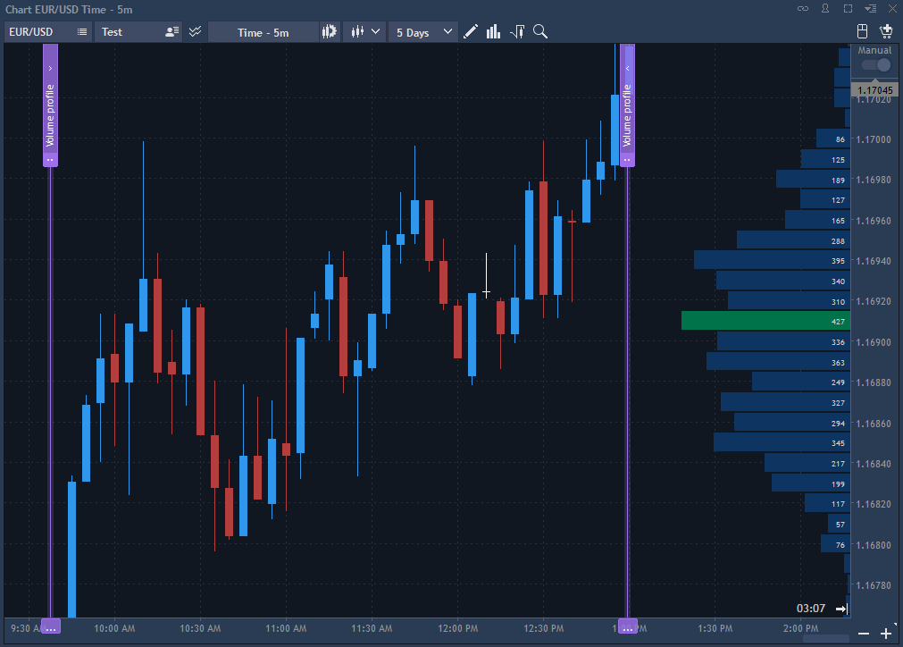
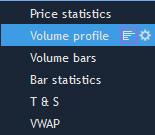
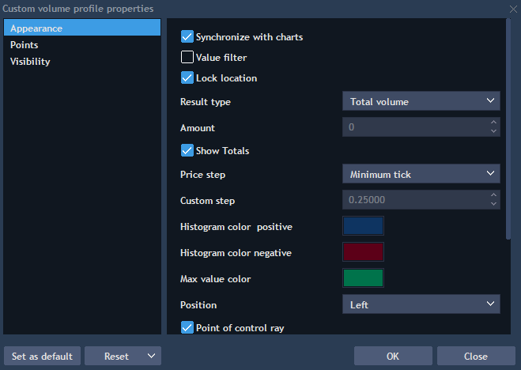

# Volume profile


This functionality allows to aggregate volume or derived calculations for a specified period of time in form of histogram on the chart. Volume profile can be opened from the Analysis tools menu by clicking on the button
or through Context menu -&gt; Analysis tools -&gt; Volume profile.

You can select a timeperiod on the chart for plotting a Volume profile with two vertical line-indicators, which are labeled as "Volume profile". 


**Note: to work correctly with the tools of analysis, except Volume bars, it is obligatory to have trade and tick history.**

Volume profile can be set up in the following way:

* Visible – controls visibility of the volume profile on the chart, when checked, the volume profile is visible on the chart;
* Properties for – this option allows selecting the section of properties to set up, available values \(types of the renderer displaying\) are: Right histogram, Left histogram, Step calculations.

Left histogram and Right histogram are exactly the same groups of settings with the only difference that volume histograms will be displayed on different axes. This option allows analyzing several data ranges at once, or analyzing data with different Result types of the same range. Right histogram type is selected by default, two other ones are not visible.

Step calculations – this group of settings allows plotting volume histogram with a predetermined step \(1 minute, hour, day, week\). Value by default: calculation period = Day, value = 1;

* Show on chart – when checked, a selected renderer's type is displayed on the chart. All three renderer types can be displayed at once;
* Value filter – when checked, such elements as Operator and Filter value appear. They allow to set up a constraint for renderers' displaying:
  * Operator – allows to select one of the comparison characters: =, &gt;, &gt;=, &lt;, &lt;=;
  * Filter value – allows to specify value to compare renderers' values with. Renderers' values, which don't correspond to a given condition, will not be displayed on the chart.

E.g., selecting " &gt;=" and specifying the value 30 will result into displaying renderers with the activated option Shown on chart \(Right histogram, Left histogram, Step calculations\) having values like 30, 31 \[...\] 45 etc.

* Width, % – allows to set up the volumes displaying area's size. For example: Width, % = 20 means that 20 % from the whole chart area will be occupied by Volume profile;  
* Result type – allows selecting what type volumes will be built by. Available values are:
  * Total volume – total volume by each price level that fell into the range of building the indicator;
  * Buy volume – shows only buy traded volumes by each price level \(defined by flag-aggressor\);
  * Sell volume – shows only sell traded volumes by each price level \(defined by flag-aggressor\);
  * Delta – shows Delta value in the form of histogram by each price level. Delta = Buy volume – Sell volume;
  * Average total size – shows average volume of one trade

Average total size = Total volume/ Trades count, where trades count – total number of trades for a specified period of time by each price level;

                 Average buy size – shows average volume of one buy trade

Average buy size = Total buy volume/ Buy Trades count, where Buy trades count – total number of buy trades for a specified period of time by each price level;

                 Average sell size – shows average volume of one sell trade

Average sell size = Total sell volume/ Sell Trades count, where Sell trades count – total number of sell trades for a specified period of time by each price level;

                Custom volume trades – this mode summarizes all trades which traded with volume greater than Amount \(set in settings\) and shows percentage of such trades in the total volume

Custom volume trades, % = Count \(Total volume &gt; Amount\)/ Total trades \* 100%;

                Custom buy volume trades – this mode summarizes all buy trades which traded with volume greater than Amount \(set in settings\) and shows percentage of such trades in the total buy volume

Custom buy volume trades, % = Count \(Buy volume &gt; Amount\)/ Buy trades \* 100%;

                 Custom sell volume trades – this mode summarizes all sell trades which traded with volume greater than Amount \(set in settings\) and shows percentage of such trades in the total sell volume

Custom sell volume trades, % = Count \(Sell volume &gt; Amount\)/ Sell trades \* 100%;

                 Trades – the number of trades by each price level for a specified period of time;

                 Buy&Sell volume – shows buy and sell traded volumes by each price level \(defined by flag-aggressor\).

* Amount – allows setting amount that is necessary for calculation of the Custom total/buy/sell volume trades parameters \(described above\);
* Show totals – when checked, a total sum of volume profile values is displayed on the chart. It is impossible to enable this option when the Result type has one of the following values: Custom volume trades, Custom buy volume trades, Custom sell volume trades;
* Calculation style – allows to select method of the data range setting. Two modes are available here:
  * From period – allows to specify date range using options From date..To date \(Custom\) or select one of the predefined options;
  * Price range – allows to specify date range in the visual mode using two vertical lines.
* Keep range – if checked, the position of renderer \(two vertical lines used to specify the range\) in the 'Price range' mode will be saved relative to the axis X when switching the timeframe or changing the trading symbol. This setting is enabled only if 'Price range' mode is selected;
* Calculation period – is active, when 'From period' is chosen in the Calculating style field. Available options are: custom, today, yesterday, current week, last week, current month and last month;
* Price step – allows setting minimal distance between price levels. Two options are available:
  * Minimum tick – distance between price levels is equal to minimal tick;
  * Custom – allows specifying random distance \(custom step\) between price levels. Custom &gt;=Minimum tick.
* Histogram color positive/negative – allows choosing histogram color for positive/negative values;
* Max value color – allows choosing color for max volume value on the histogram;
* Labels – allows choosing whether to show or not labels on the histogram. The following options are possible:
  * None – labels are not shown;
  * Left – labels are shown inside the histogram aligned to the left;
  * Right – labels are shown inside the histogram aligned to the right;
* Font color \(section Appearance\) – allow setting style of the labels displaying.

### Custom volume profile

This tool allows plotting custom profiles by selected area of the chart.

When activating the button for plotting the profile, a crosshair transfers to the selection mode of the data area for further analysis.


  
Selection of the area for plotting: click on the button=&gt; click the chart to set up the first border for plotting area selection =&gt; click the chart to set up the second border for plotting area selection:


After an area selection, vertical selectors will be hidden from the chart. In order to use a mode of the data range modification for analysis, you should click on the left border of the Custom volume profile, then vertical selectors will be visible again and available for editing.

Right clicking one of the vertical selectors allows such options as: Settings, Remove selected, Lock location.

You can set up the Custom volume profile properties by selecting the option Settings:


The panel Custom volume profile properties allows the settings which are available for Volume profile as well, you can read about them above. However, this panel contains a couple of such specific options, as:

* Point of control ray – if checked, a line with maximal profile volume will be extended to the axis;
* Synchronize with charts – if checked, a custom volume profile tool will be synchronized in all the chart panels of a selected symbol.

Custom volume profile with the checked Point of control ray:

