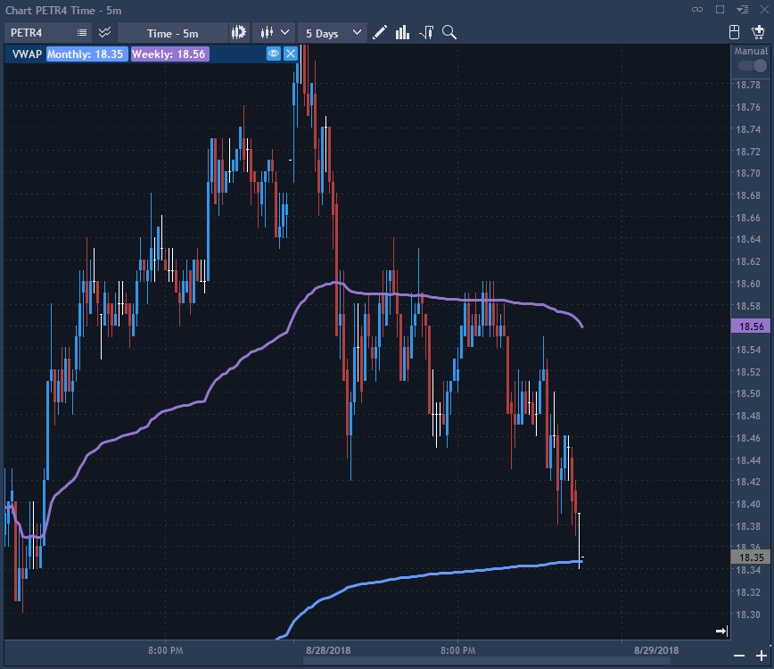

# VWAP

VWAP allows calculating a cumulative volume-weighted average price for defined period.


Visible – controls visibility of the render on a chart. Default state – False.

Use tick data – if checked, then VWAP is counted using trade prices and its volumes. In this case, combobox 'Calculation price' is not active. If checkbox 'Use tick data' is unchecked, then for each minute bar the value of minute VWAP is equal to the chosen price of minute bar, which is selected in the combobox 'Calculation price';

Historical mode – allows determining whether the render will count its historical values. Default state – False.

* If Historical mode is checked, then render counts both historical and current values.
* If Historical mode is not activated, then render counts only current values.

Calculation price – allows to choose the price, which will be used as basic values of VWAP \(min\), if Use tick data=False. The following options are available:

* Close;
* Open;
* High;
* Low;
* Typical - calculations are made by the formula \(High + Low + Close\)/3;
* Median - calculations are made by the formula \(High + Low\)/2;
* Weighted - calculations are made by the formula \(High + Low + Close + Close\)/4.

Line \#1:

Line visible – allows visibility of a certain line of render. Default state – False.

Calculation cycle – cycle for calculation of cumulative VWAP value. The following options are available:

* Date – render counts its values from the beginning of a trade day till the end of it.
* Week-to-date – render counts its cumulative values from the beginning of a trade week till the end of it.
* Month-to-date – render counts its cumulative values from the first day of a month till the end of it.
* Intraday – render counts its cumulative values from the beginning of a trade day till the end of each trade day with the period which is set in ‘Intraday cycle’.

Start/End day time – allows to determine time of start and end of a day;

Intraday cycle – allows to determine the period of a cumulative calculation of values of render in minutes from the beginning of every trade day.

VWAP = ∑ price i \* size i / ∑ size i,

where 'size i' is the volume traded at 'price i' .

Start/End day time – defines the stard and the end of a trade day.

Intraday cycle – defines the period of cumulative calculations of render values in minutes from the beginning of a trade day. In one trade day can be lots of intraday cycles.

Line style – a set of standard controls for settings of visual look of a render.

Line \#2 and Line \#3 have the same settings as Line \#1.

