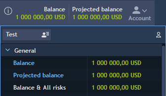
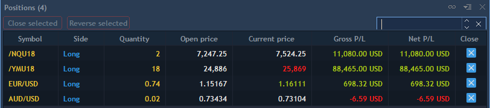

# Arranging panels


User can create own trading environment by displaying/hiding and rearranging panels. To build a workspace from scratch, click on the button
at the status bar and blank workspace will appear. Then open the panels which will be used in Trading terminal and arrange them as described below.

### Attaching and detaching panels

There are two main location types for all panels:

* Attached – panel is located in some place of workspace.
* Detached – panel is located separately and can be used independently of any workspace.

 Each panel has default location. Some panels are attached by default, others are detached. Default settings created on base of target usage. To change the location click on the controlwhich is available in the header of each panel. The following options can be available in the opened menu:

* Attach – allows attaching panel. After clicking panel will attach to default place. Then user can move it to any place of the workspace. After taking header of the panel the following buttons appear:

Drag the panel into the button to preview it's next position.


Attached panels can be arranged into tabbed areas where one or more panels are conveniently fit under/over/beside other panels.

* Detach – allows detaching panel.
* Autohide – allows hiding panels. After clicking Autohide, panel hides to a label pinned along the edge of the main window. When moves the mouse over the label, the panel expands halfway into the workspace. Click Autohide again to expand the panel. This option is available only for attached panels.
* On top – allows seeing the panel on top of all others. Applicable only for detached panels.
* Help – allows opening information about current panel in TraderEvolution Guide.
* Duplicate panel – allows duplicating the chosen panel.
* Show toolbar – allows showing toolbar of the chosen panel.

 Clicking on the button
allows opening attached panel in fullscreen mode. Available only for Chart.

### Creating tabbed areas

Creating tabbed groups of panels helps save screen space and maximizes efficiency. To make a panel appear as a tab, drag it over another panel \(or tabbed area\).

### Linking panels


One of the advantages of the Desktop terminal is linking panels. Currently two types of link are available :

* **Symbol link**– 
  when panels are linked, selecting a symbol in one of the panels synchronizes other panels in the group to display information relevant to that symbol. For example, when Order entry panel is linked to a Watchlist panel, the symbol displayed in the Order entry panel will be changed in accordance with the symbol selected in the Watchlist. The links are identified by a color:

                                                                              

To link two or more panels together:

1. Click on the link icon in one of the panels you want to link.

2. From the drop-down menu, select one of the colors. The button changes to display the color.

3. Repeat the same procedure for the other panels to be linked, selecting the same color.

To unlink a panel from a group, click the panel's link icon and select 'None'.

* **Account link** – 
  linking by account is available by checking an iconlocated at the top right corner of Accounts widget. 

By clicking on this icon, it turns green
and appears in all panels which contain Account lookup. This function filters your positions and orders by account. When Account Link is checked, then changing the account is possible via Account lookup of any panel. The account will be switched synchronously in all panels.

### Searching elements

All table panels in the application have a quick searching function. Traders can search for the needed items using:

* hot button combination "Ctrl + F";
* "Search…" menu item by selecting it from the Context menu.

 After evoking a search by one of the methods listed above, the following lookup will be activated, 
where users can type symbol\(s\), number\(s\), a word or a part of it in order to find it in the table. To close the search lookup, click on the button.


Back and Forward buttons– 
allow to move among the results of the search. Left to these buttons there are numbers showing on what search result you are now and what is the total number of search result. The search result on which you stopped moving is highlighted.

* Search works by the partial matches of a search query with the data specified in the table;
* Search results are sorted by relevance;
* If table panel has been filtered before the quick search, then search will be performed by the filtered data selection;
* Reset of the search occurs when user removes a search query from the lookup.

