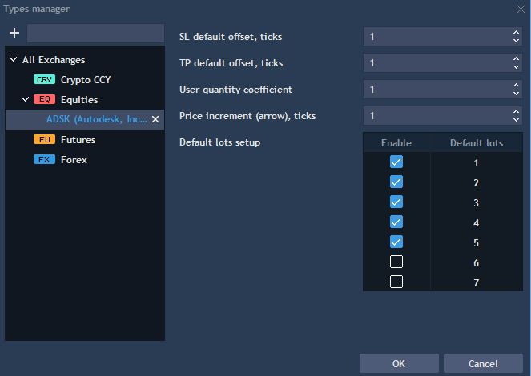
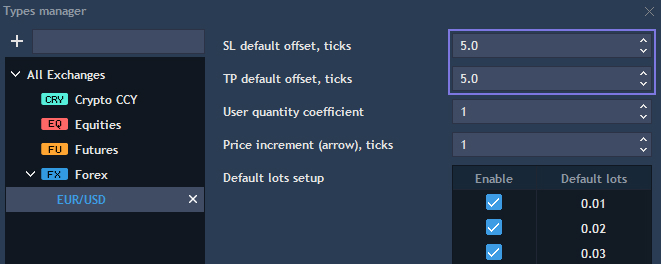
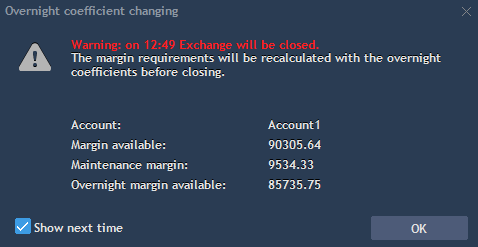

# General settings

The General Settings menu is used to customize and change general properties of TraderEvolution App. To open it, click on thebutton at the top toolbar of the App.

### **General**

* Language - defines the default language of the UI. To set up your preferred language simply select it from the list;
* Info bar - check to display a comprehensive info bar over your Workspaces;
* Enable sounds - check to allow sound notifications;
* Synchronize cursor - synchs cursor among charts;
* Mouse wheel - select the action to be performed when scrolling the mouse wheel, it's either scrolling or zooming in and out.

### **View**

* Rounded average open price – check to round open price of positions in Watchlist, Positions, Filled orders, Market depth and other panels \(tick size=instrument tick size\);
* Display quantity in lots – check to view orders quantity in lots, uncheck to view in units;
* Abbreviate volumes – check to abbreviate volume values in all panels. For example: 1000 will be displayed as 1K, and 1000000 – 1M;
* Reverse buttons order – check to reverse trading buttons into Sell/Buy pattern;
* Tooltips – check to display all tooltips in the application, uncheck to hide. The function is enabeled by default.

### **Trading defaults**

* Account – specifies your default account, for multi-account users only;
* Symbol – specifies your default symbol. The default symbol will be shown whenever you load the Chart panel or the Order entry panel;
* Set SL/TP values in offset \(for new orders\) – check to display order prices in offset, uncheck to display in absolute values;
* Show offset in – allows to select one of the available modes for offset displaying:
  * Ticks;
  * Ticks \(fractional ticks for Forex\);
  * Points.
* Use stop limit instead stop – check to place stop limit orders instead of stop orders. When checked activates the 'Limit offset, ticks' field;
* Limit offset, ticks – use to adjust the default quantity of ticks for offset of a limit price. Active only if 'Use stop limit instead stop' is checked;
* Order type – use to specify an order type, available values: Market, Limit, Stop, Stop Limit, Tr. stop, OCO, Manual;
* Market/Limit\(Stop limit\)/Stop TIF – use to set up TIF for Market/Limit \(Stop Limit\)/Stop orders respectively. Operates in both auto and manual trading;
* Types manager – use to set your default parameters per order.

Open 'Types manager' to apply additional settings to orders. Select the market - Forex, Futures, Equities, etc. to set the Default lot values. It is also possible to override default lots values for separate symbols by adding them to the symbol types tree using "+" button. In order to apply symbol type default lots settings, just delete symbol from the tree using context menu:

* SL/TP default offset, ticks – specifies a default value of offset field for SL/TP;
* User quantity coefficient – is a default increment applied to all quantity counters;
* Price increment \(arrow\), ticks – determines the increment value \(e.g. the Limit price field in the Order entry panel\) when pressing the Up Arrow \(^\) key;
* Default lots setup – allows enabling default lot sizes for orders of selected symbol types or specific symbols which will be available in OE section.

If 'Show offset in = Ticks \(fractional ticks for Forex\)', then options 'SL/TP default offset, ticks' in the Forex instrument type will be displayed in decimal view and in the corresponding format. For example, 10 ticks will be displayed as 1.0, and 50 ticks as 5.0, depending on which value is set in the option. If 'Show offset in' is NOT 'Ticks \(fractional ticks for Forex\)', values of the options 'SL/TP default offset, ticks' are displayed by default, e.g. 10 ticks, 50 ticks.

### Confirmations


In Confirmations section all of the options are fairly intuitive:

* Confirm order placement - check if you want to confirm each order placement;
* Confirm order cancellation - check if you want to confirm each order cancellation;
* Confirm order/positions modification - check if you want to confirm each order/position modification;
* Confirm position closing - check if you want to confirm each position closing;
* Confirm position reversing - check if you want to confirm each position reversing;
* Confirm idea deleting \(Trading idea\) - check if you want to confirm deleting of a Trading idea.

### **Warnings**

* Warn if wrong order – if checked, you get a warning message in case of placing order with incorrect parameters;
* Warn if today's volume exceeds - allows to select today volume level at which the system will display a warning message;
* Warn if order quantity exceeds – allows to select a quantity level at which the system will display a warning message;
* Warn if order capital exceeds – allows to select an order capital level at which the system will display a warning message;
* Warn if available funds less – allows to select available funds level at which the system will display a warning message;
* Warn if today's gross less – allows to get a warning message in case if a level of today gross is less than in set parameter;
* Show symbol halt warnings – if checked, you will get a warning message in case a trading halt on symbol occurs;
* Warn if close Strategy manager with active strategies – if checked, you will get a warning message in case Strategy manager is closed with active strategies;
* Show overnight margin notification message – if checked, you will get a warning message in case if a position is transferred overnight.


If you have open positions on symbols which have overnight coefficients, you will get overnight margin notification message "Warning: on 12:49 Exchange will be closed. The margin requirements will be recalculated with the overnight coefficients before closing".

The overnight warning message shows the following items: Account \(Account for which the margin coefficients are switched to overnight\), Margin available, Maintenance margin \(based on overnight coefficients\), Overnight margin available.

Overnight margin available = Balance + all risks - Overnight total maint. req.

If Overnight margin available &lt; 0, user will get a message "You don’t have enough margin for overnight, we force close some positions and cancel orders".

### RSS


Using this settings section, the user can add or edit RSS feeds in order to view news through RSS panel.  
Read more about RSS panel here: 

[https://guide.traderevolution.com/project/desktop-application-for-windows/informative-panels/rss](https://guide.traderevolution.com/project/desktop-application-for-windows/informative-panels/rss)_._

