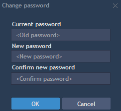

# Installation and updates

TraderEvolution Desktop App performs automatic updates, meaning you don't need to search and install and worry about the latest updates of the software. The average download size is 30 MB.

To install TraderEvolution Desktop App simply run the .exe file and select the installation directory. Click Install and wait for the TraderEvolution to complete the installation for you.

### How to update TraderEvolution Desktop App?

When you launch your TraderEvolution Desktop App, an Update manager will launch an automatic update. Thus, you don't need to install the latest updates of TraderEvolution manually.

### How to Uninstall TraderEvolution from your PC?

To uninstall the TraderEvolution, go to Start -&gt; Programs -&gt; 'Name of the terminal' -&gt; Uninstall. You can also uninstall TraderEvolution from the Control panel.

Uninstalling TraderEvolution won't remove default settings or connections. These data are stored in your profile folder, which is located in one of the following locations, depending on your operation system:

Windows Server 2016, XP - Documents and Settings\&lt;UserName&gt;\Application Data\Folder with terminal.

Windows Vista \(no longer supported\), Windows 7 \(no longer supported\), Win 8.1/10 - Users\&lt;UserName&gt;\AppData\Roaming\Folder with terminal.

After re-installing TraderEvolution into your PC, the newly installed TraderEvolution App will parse the data from your profile folder.

### **How to Login?**

Launch the TraderEvolution Desktop App and enter your credentials to log into your terminal.

### **How to change your password?**

Passwords can be changed anytime by using the following methods:

1. Before logging in to the App:

If you do not remember your password, simply click on the 'Forgot password' and follow the next steps:

* Enter your Login ID in the Login field;
* Enter your email address in the Email field;
* Click Recover to get your recovery key;
* Check your email for the recovery key and enter it into the Key field;
* Put down your new password and click Recover.

2. After logging in to the App:

Go to your Account menu on the top toolbar:

Select 'Change password' to change your password used to login to the TraderEvolution App.

Select 'Change trading password' to change your password used before performing any trading operation.

To change the password:

* Enter your current password in the Current password field;
* Enter your new password in the New password field;
* Re-enter your new password in the Confirm new password field;
* Click OK to activate your new password.

**Errors and troubleshooting**

You might see some warning messages when changing your password. Below please find a warning message and its interpretation:

1. Incorrect current password or login - this message is displayed if your entered old password is incorrect or the user does not exist in the system.
2. Incorrect new password: you cannot use the same password - this message is displayed if your entered new password is similar to the old one.
3. New password contains prohibited symbols - this message is displayed if your entered new password contains prohibited symbols \(for example, & etc.\).
4. Password cannot be the same as login - this message is displayed if your entered new password matches the login.
5. Please enter new password - this message is displayed when new password has not been sent to the user or the new password field is empty.
6. Incorrect new password: password should contain 1 number and 1 uppercase letter - this message is displayed if your new password does not meet the required level of password security \(To keep yourself safe and protected, please enter a stronger and more secure password\).
7. Incorrect new password: password should contain at least 8 chars and numbers - this message is displayed if your new password does not meet the required level of password security \(To keep yourself safe and protected, please enter a stronger and more secure password\).
8. Incorrect new password: password should contain at least 8 symbols including chars, numbers and special symbols - this message is displayed if your new password does not meet the required level of password security \(To keep yourself safe and protected, please enter a stronger and more secure password\).

