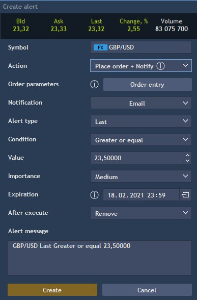

# Alerts

To open the Alerts panel, click on the
button which is located at the header of the TraderEvolution terminal. In order to create an alert, click on the 
button at the bottom of the panel.

A user can see Bid, Ask, Last, Change% and Volume data by the instrument, selected in the symbol lookup of the panel.

* Symbol – the symbol lookup allows to select an instrument by which the alert will be created;
* Notification – allows to select a type of notification to be sent, available values are Email, Push, Pop-up, Sound. Multiselect is available here;
* Alert type – allows to set an alert type. Available options are the following: Ask, Bid, Last, Change%, Volume;
* Condition – allows to set an alert condition. Available values are the following: &gt;,&lt;,&gt;=,&lt;=;
* Value – allows to set a value of Alert type for reaching the condition;
* Importance – allows to define the importance of the alert. The following options are available: High, Medium, Low. After execution of the alert, a user gets a notification with the corresponding color of the indicator which depends on importance of the alert;

* Expiration – date/time picker that allows specifying the period of alert lifetime. The expiration date is set in the corresponding calendar control:

* After execute ****– allows to choose alert behavior after execution. Available options are the following:

            -       Stop – after execution alert is not active but stored in the list of alerts;

            -       Remove – after execution alert is removed.

* Action – allows to set up the action to be performed after alerts’ execution:

           -        Place order + Notify – alert is performed according to the notification type and order placing occurs;

           -        Notify – user is notified without placing an order, this value is set by default;

* Order parameters – becomes available only when 'Place order + Notify' option is selected in the 'Action' control. Allows to open standard Order entry panel to configure the required parameters of the order to be placed after alert triggering;
* Alert message – allows to type the text of the alert message. The text in the Message box is generated automatically but a user can customize the text of the notification;
* Create button – allows to create an alert. The button is colored according to importance of the alert.

### **Alerts management**

A user can see created alerts and work with them – both with executed and not executed ones.

The maximum number of alerts which can be added to the panel is 100.


There are the following columns in the table of the Alerts panel:

* Instrument – instrument name by which the alert was created;
* Condition – the alert is executed by reaching the condition;
* Controls – the set of controls for each alert:

          -       Play – click on the button to re-start the alert. The button is visible for executed alerts;

          -       Stop – click on the button to stop the execution of the alert. The button is visible for not executed alerts;

          -        Edit – allows to open editing screen;

          -        Remove – allows to remove alert. By clicking on the button, the confirmation window will appear.

### 
**Alerts on chart**

The chart displays all active alerts for the instrument selected in the symbol lookup. If the alert is executed, it will not be shown on the chart, but its presence in the panel is controlled by the ‘After execute’ parameter. The chart displays all alerts for an instrument, for Ask, Bid, Last types.

To create a new alert on the chart, click on the
button which appears near the price scale at the chart while hovering the certain price level:


All active alerts created by the same instrument are visible on the chart. After execution the alert is removed from the chart. The buttons which allow to editand removean alert become visible while hovering the alert’s icon. 
The color of the alert’s icon depends on importance of the alert.

By clicking on the Edit control, the Editing screen is opened. Editing of the alert from the chart is also possible by using the Drag&Drop function. While using this function, the alert is modified without additional confirmations. 

