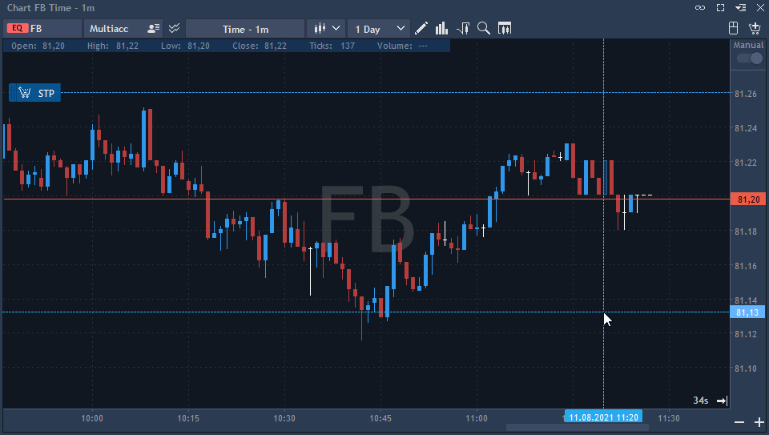

# How to...

#### **1. How to reset your password?**

Reset your password following the recommendations from the ‘Changing password’ section: 

[https://guide.traderevolution.com/project/desktop-application-for-windows/getting-started/installation-and-updates](https://guide.traderevolution.com/project/desktop-application-for-windows/getting-started/installation-and-updates)

#### **2. How to find the Order ID / Position ID?**

1. Open the Positions/Working orders panel; 
2. Right-click on any column name;
3. Select the Position ID/Order ID from the list.

#### **3. How to execute a partial close?**

* Select the position to be closed from the Positions panel. Right-click and select ‘Close position’;
* You can also double click on the position to call the 'Close position' dialog window. Select ‘Quantity to close’ to execute a partial close of the position;

* Or simply place a reversed order for the same instrument.

#### **4. How to place an OCO order?**

An OCO order is a combination of a Stop order and a Limit order. You can set prices for both of these orders and place 2 orders at the same time:

* Place an OCO order by selecting OCO in the Order type section of the Order entry panel;

* You can also place an OCO order using Visual trading directly on the chart:


The ability to place OCO orders must be activated in the User's details -&gt; General trading rules section of BackOffice.


#### **5. How to place a trailing stop?**

* Place a Trailing stop order by selecting Trailing stop in the 'Order type' section of the Order entry panel;


The ability to place Trailing stops must be activated in the User's details -&gt; General trading rules section of BackOffice.


* To replace a Stop loss by Trailing stop in the Order entry panel, simply click on a specialbutton loacted near Stop loss. The blue color of thebutton indicates that the Trailing stop is activated; 
* You can place Closing Trailing stop directly from the chart, using Visual trading functionality and modifying an order or a position in the same way:

#### **6. How to add a price alert?**

1. Open the Alerts panel by clicking on the correspondingbutton at the header of the terminal;
2. Setup conditions which will trigger your alert and finally select the actions to be taken.

**7. How to disaggregate the Market depth?**

1. Open settings of the Market depth panel;
2. Select the 'View' section of the 'General' tab. Select the 'By order' option in the drop-down list of the 'View by' setting. Click Apply.  

**8. How to show filled orders on the chart?**

1. Select the ‘Visual trading’ section in the Chart settings;
2. Tick on the 'Filled orders' box to make filled orders visible on the chart.

#### **9. How to enable VWAP?**

* Click on ‘Analysis tools’ and select the 'VWAP' from the list;
* You can enable VWAP on a Chart, Market depth, Scalper, Matrix and Order Entry panels;
* Read more about VWAP here: 

[https://guide.traderevolution.com/project/desktop-application-for-windows/analysis-tools/chart/volume-analysis/vwap](https://guide.traderevolution.com/project/desktop-application-for-windows/analysis-tools/chart/volume-analysis/vwap)

#### **10. How to find a volume by price?**

In TraderEvolution there are few options to view the volume by price:

* The Market depth panel allows to view the volume per each price level;
* Info Window in the Chart panel contains the volume value;
* To plot Volume bars on the chart, select 'Volume bars' in the Analysis tools.

#### **11. How to track the auction price at opening?**

* Right-click on any column name of the Watchlist;
* Select the 'Indicative auction price' from the list;
* A column named 'Indicative auction price' should appear.

#### **12. How to open multiple charts?**

You have two options here:

* Open the Grid panel: [https://guide.traderevolution.com/project/desktop-application-for-windows/analysis-tools/grid](https://guide.traderevolution.com/project/desktop-application-for-windows/analysis-tools/grid)
* Open several Chart panels: [https://guide.traderevolution.com/project/desktop-application-for-windows/getting-started/arranging-panels](https://guide.traderevolution.com/project/desktop-application-for-windows/getting-started/arranging-panels)

#### **13. How to color brokerages in the Market depth?**

1. Open settings of the Market depth panel;
2. Select the ‘Colors’ tab;
3. From the drop-down menu of the ‘Coloring method’, select the ‘By source and volume conditions’ option.

#### **14. How to add a previous close line on the chart?**

1. Open the context menu of the chart panel;
2. Select ‘View’ -&gt; ‘Previous close’.

#### **15. How to plot a chart within the Scalper?**

1. Open the Scalper settings from the context menu of the panel;
2. Open the ‘Time & Sales chart’ tab;
3. Select ‘Trades & Quotes’ from the drop-down list of the 'Mode' section;
4. Apply changes.

#### **16. How to enable DDE Link?**

1. Open the context menu of the desired panel with DDE link;
2. Click on Export and select Excel from the list;
3. Make sure to check the ‘Synchronize’ checkbox;
4. Click Export.

#### **17. How to show time to next bar?**

1. Right-click on the Chart panel;
2. Select ‘View’;
3. Click on the ‘Time to next bar’ option to enable the countdown visible.

#### **18. How to modify a pending order?**

1. Right-click on a pending order in the Working orders panel and select ‘Modify order’;
2. Use the editable boxes to change quantity, order price, time in force, and the OCO order. To specify a new order price, use the Price field; the Current price field shows the market price. 
3. Click ‘Modify’ when done.

