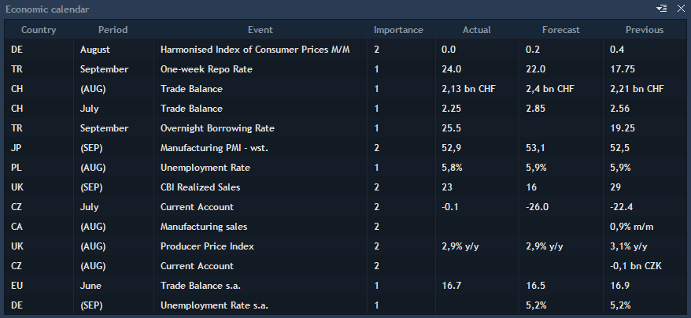
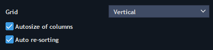
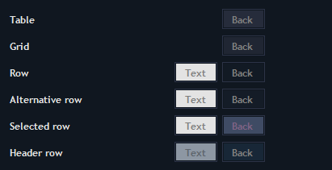

# Economic calendar

Economic calendar panel displays the list of scheduled events that may affect movement of prices of financial instruments or global markets as a whole. To open Economic calendar panel, select Tools -&gt; Economic calendar.


The following columns are available for the panel:

* Date/Time – date and time of the event.
* Country – country of the event.
* Period – period for which the value is taken.
* Event – names of the events which are scheduled.
* Importance – significance of the events.
* Actual – evaluation of the event according to actual data.
* Forecast – current forecast value.
* Previous – previous forecast value.
* Remark – remarks to the event.

Note: if any columns are not supported by Economic calendar provider those fields will be empty.

### **Economic calendar settings**

Economic calendar settings can be opened from the context menu of the panel.

The settings of the Economic calendar panel consist of 2 tabs in the column ‘General’: View and Colors.

**View**


Grid  – allows activating and setting up grid. Vertical, Horizontal, Vertical & horizontal, None.

Autosize of columns – automatically sizes columns so that their total width would be equal to the width of a panel. If disabled, each column will be sized by maximum length.

Auto re-sorting – allows auto re-sorting a table after any changes.

**Colors**


Table, Grid, Row, Alternative row, Selected row, Header row – allows configuring the color scheme for the table.

