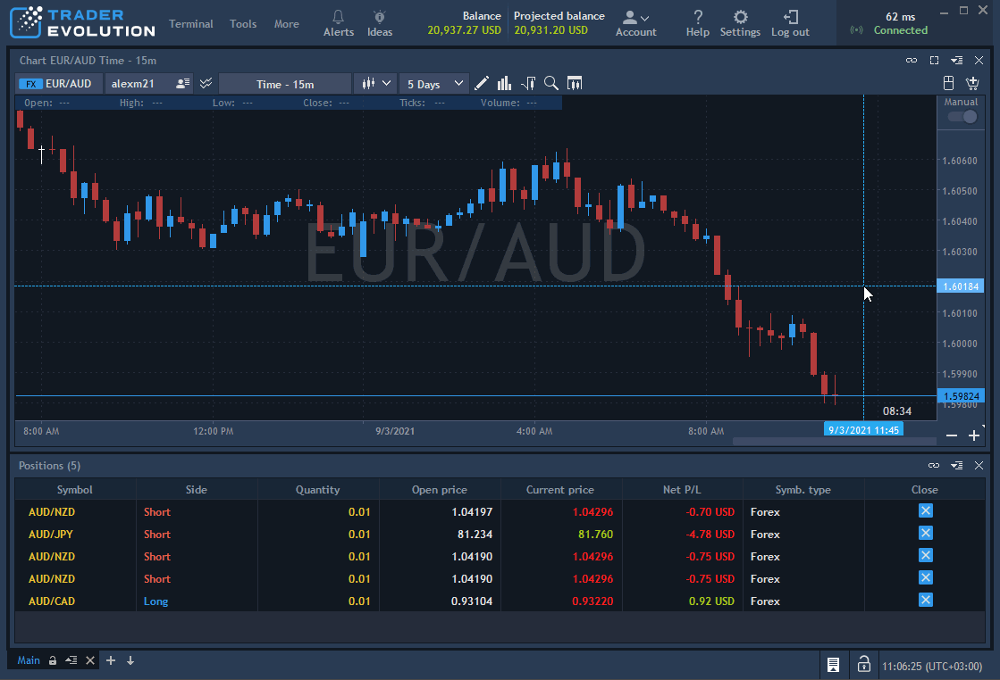

# Event log

Event log panel shows a log of all events that occurred during trading sessions. Click on thebutton
 in the Status bar to open the Event log panel.

Available columns:

* Type – type of event.
* Date – date and time of event.
* Event – title of event.
* Details – the text of event message is shown in the tooltip of the ‘Details’ icon. Click this iconto open a deal ticket.


If there is no message and deal ticket for event, then the ‘Details’ icon isn’t shown. 
  
The user can select a time period for which he wants to see logs. Pick the required one from the "Range" drop-down
. Click thebutton to select event types which are required to be shown in the panel.

The following types are available:

* Exception – allows showing all problems appeared during work sessions. All exceptions are displayed in white color text.
* System – allows showing all problems with connection to server.
* Trading – allows showing all trades operations. The following color schemes are used for trade logs:

       - White text – for all unconfirmed requests;

       - Green text – for created orders;

       - Red text – for removed orders;

       - Yellow rows filling – for filled orders.

* Updater – allows showing all information about system updates.


To clear the Event log table, call the context menu with right-clicking anywhere on the table and select Clear:.

This option doesn't delete data, this is just for clearing a current Event log panel view.

