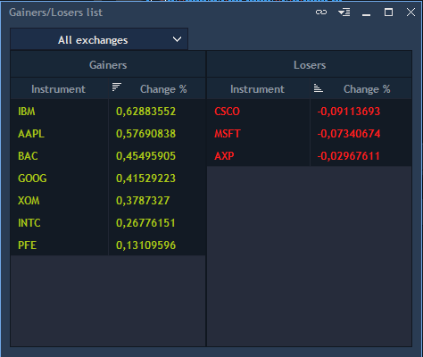

# Gainers/Losers list

This panel displays two lists, one with the Instruments with the biggest positive "Change %" parameter \(Gainers\), and one with the smallest negative "Change %" parameter. The panel lists are populated based on the algorithm configuration on the server and have the following view:

 In the panel, the following controls and info columns are available:

* Exchanges drop-down list - drop-down list with checkboxes for selecting the Exchanges, the Instruments subscribed to which are included in the lists;

The following columns are available for both Gainers and Losers lists and allow independent filtering for each list:  

* Instrument - the Instrument name;
* Change % - the percentage value of the difference of the previous close price and the current price for the Instrument.

By default, the Instruments in the Gainers list are highlighted in green and those in the the Losers list in red color:

The user can select other colors for highlighting the items in the panel lists. The features of grouping items by Exchange \(common for both lists\), type of grid \(None, Vertical&horizontal, Vertical, Horizontal\) selection, column autosizing and showing toolbar are available for the panel in the Panel-&gt;Settings menu.

