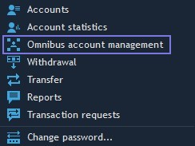
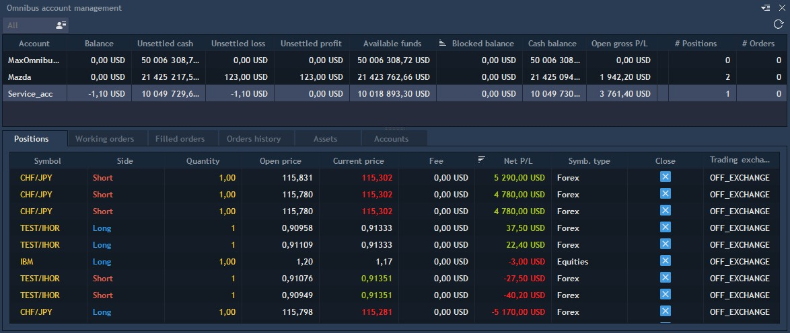

# Overview

Omnibus accounts allow aggregating multiple User accounts into a single entity to operate these accounts with more convenience. That is, an Omnibus account is a consolidated account of several investors, organized by financial intermediaries such as brokers or banks. For example, one company can create an Omnibus account, uniting all its clients in it for the convenience of brokers. The Omnibus account is traded for several different investors and is not associated with the name of any of them. It looks like the stockholders, but their stocks are held by Omnibus investors, not the company. Thus, investors do not need to take responsibility for the stock, and most of the work rests on the shoulders of brokers.  
In order to open the “Omnibus account management” panel, select it from the drop-down list after clicking the “Account” icon in the header of the terminal.

This will open the “Omnibus account management” panel:

This panel consists of two parts: the panel that contains info on Omnibus accounts and the one that contains info on positions, orders, and assets.

