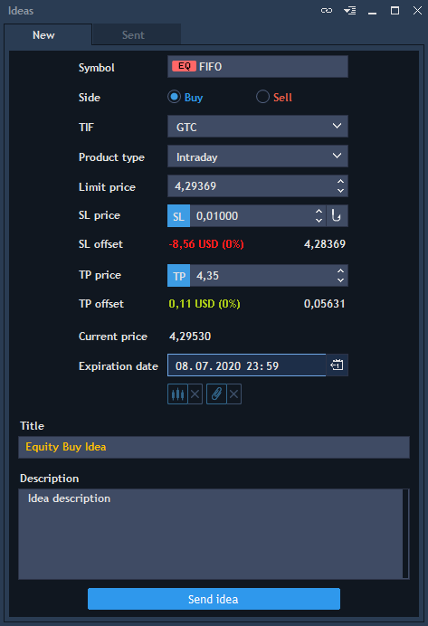
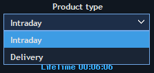
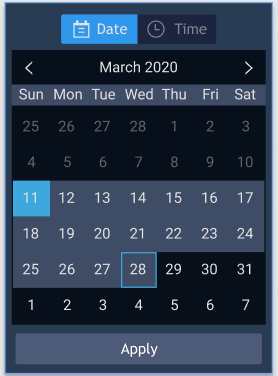
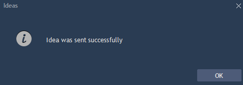
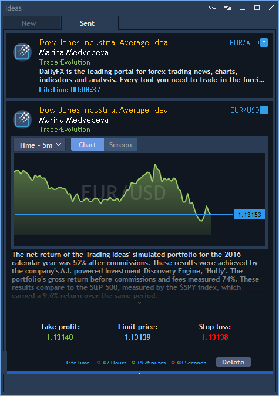
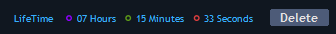
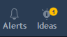
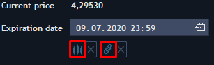
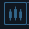

# Trading ideas

A Trading idea or simply an Idea is an investment recommendation based on the market analysis. It includes predefined parameters for order placement as well as text description and chart snapshot.

The panel allows to send Ideas and subscribe to them, depending on the user’s role – user-analyst or user-subscriber.

### **User-analyst**

User-analyst is a user who can create, delete and send Ideas to user-subscribers but is not allowed to trade by himself. For the user-analysts the Ideas analyst panel is available in the terminal from the ‘Tools’ list in the Top menu. Ideas analyst panel contains 2 tabs:

**New** – ​tab that allows setting all parameters for sending a new Idea:

In order to send an Idea, a user-analyst has to specify mandatory order parameters:

* Symbol – allows selecting the instrument that will be used in the Idea;
* Side – allows selecting Idea operation side: buy or sell;
* Validity – dropdown list for selecting the order validity type \(Day, GTC, IOC, FOK, GTD\);
* Product type – dropdown list for selecting the type of the product for the Idea. This parameter becomes available, when the product type for the symbol used differs from the General. Available options: Intraday, Delivery.

With that, if the product type available to the User subscriber differs from the one specified in the Idea by the User analyst, the User subscriber can switch from "_Delivery"_ to "_Intraday"_ product type:

If there is only one product type available to the User subscriber and it differs from the one specified in the Idea by the User analyst, in the Idea view for the subscriber, only the available product type is displayed with no option to change it by the User subscriber;

* Limit price – field for entering the limit price for the order;
* SL price – Stop Loss price of the order;
* SL offset – field that shows the SL offset value;
* SL limit price – Limit price for SL order;
* SL limit offset – Limit offset for SL order;
* TP price – Take Profit price of the order;
* TP offset – field that shows the TP offset value;
* Current price – field that shows the current symbol price \(if available\);
* Expiration date – allows specifying the period of the idea lifetime, during which a user-subscriber can accept the idea. The expiration date is set in the corresponding calendar control:    Format: “dd.mm.yyyy hh:mm” \(day.month.year hours:minutes\). \(min = 00 hours : 01 minutes; max = 30 days 24 hours : 00 minutes\);
* Title – allows entering a title of the Idea. The title cannot contain more than 50 symbols.

The following options are not mandatory:

* Description – allows entering a description of the Idea; 
* Add chart screen – allows attaching a Chart snapshot to the Idea. Clicking on the button ‘Add chart screen’ opens the detached Chart by the chosen instrument. Then just press the button ‘Take snapshot’ and click on a tick. After taking a snapshot, the button ‘Add chart screen’ will change to ‘Remove’, click on it in order to delete the Chart screen. The
  button allows opening the full-size screenshot.

After specifying all the parameters of the Idea, the user-analyst needs to click on the ‘Send’ button to send the idea. In case of a successful Idea sending, the user gets a notification:


**Sent** –​ tab that contains the ideas sent by the user-analyst. In this tab, the user-analyst can see and delete Ideas, which lifetime is not expired:


The sent Idea becomes visible for the user-analyst in the ‘Sent’ tab. In this tab, the user-analyst can view the idea parameters specified before sending.


Click on the certain Idea to open it. If a user attaches a chart screenshot, it will be displayed in the Idea. Press the screenshot to open it in the full-size mode. In the ‘Chart’ tab user can choose the desired timeframe.

After expiration of the Idea, it will be removed from the panel. In order to delete the Idea, click on the 'Delete' button located next to its lifetime.

### **User-subscriber** 

User-subscriber is a user who is subscribed to user-analyst’s Ideas. For the user-subscribers, only the subscriber panel is available in the terminal and they can only see and accept Ideas. Click the
button in the Status bar to open this panel. Clicking on this button for the first time evokes the window with Risk disclosure. Pressing the button ‘I agree’ allows to accept it.

To receive an Idea and place the order based on this idea, the instrument used in the idea must be available to the user-subscriber. After receiving a new Idea, the notification with the number of received Ideas will appear in the main upper panel of the terminal near the Alerts icon:


A user-subscriber can see the sent Ideas in the panel:

In the panel, the user-subscriber can see the text description of the idea, remaining lifetime, Take profit, Limit price and Stop loss values of the Idea, can view the Chart snapshot \(if added\) and place the order based on the idea. User-subscriber can also select or enter the quantity for the Idea order to place by using the drop-down Quantity list. After clicking on the ‘Place sell/buy order’ button in the open Idea, an order placement confirmation dialog box is displayed:

Click on the ‘Yes’ button to place an order based on the Idea. After the order is placed, the User can manage it together with the existing orders.

### Attachments

When creating an Idea, a User-analyst can attach a snapshot of a Chart of the Instrument used in the Idea and a jpeg, jpg, png or PDF file \(10 Mb or smaller\) containing relevant information by clicking the icons under the Lifetime setting field of the Idea creation menu:

Clicking the chart symbol icon  \(on the left\) opens the Chart window for taking a snapshot, in which the User-analyst can select the needed Instrument and configure the Chart parameters:

Having configured the Chart, the User can take the snapshot by clicking the "Take snapshot" button in the right lower corner. After the Chart snapshot is taken, it can be saved and automatically attached to the Idea by clickign the symbol in the right lower corner of the menu window:

Clicking the  symbol in the main Idea creation menu opens the explorer window for browsing to a jpeg, jpg, png or PDF file, which the User-analyst chooses to attach to the Idea.

After the Chart snapshot and file are attached to the Idea, their symbols become highlighted:

The User-analyst can remove a snapshot or an attached file by clicking the cross icon near the corresponding symbol.

After an Idea is sent, the User-subscriber can open the Idea expanded view and open the attached file or snapshot by clicking the corresponding icon in the menu:   

