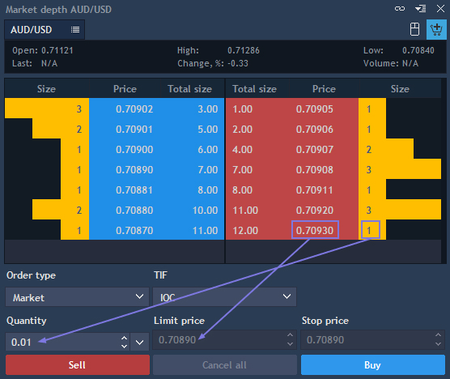
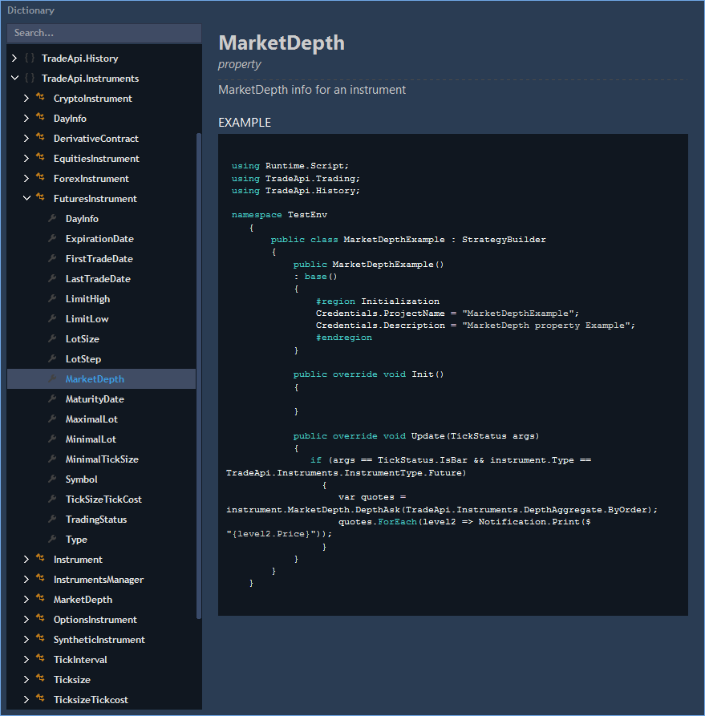
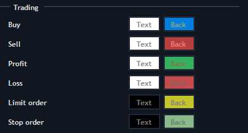

# Market depth

The Market depth panel allows to view and trade Level II quotes. To open a new Market depth panel, go to Terminal -&gt; Market depth.

The Market depth panel consists of several sections:

* Level I - only Level I quotes;
* Position bar - short information about opened positions \(quantity, average price, current profit and loss\).


P/L value is displayed in currency or in ticks/points depending on what option you choose clicking on it.

Selection between 'P/L by currency' and 'P/L by points' is available when 'Show offset in = Points' in the section 'Trading defaults' of the 'General settings'.

Position bar has extended functionality for Multiple position mode:

When clicking on the Price value, one of two options can be selected: 'Average open price' or 'Break-even'.

       Break-even = \(Long qty.\*Average long – Short qty.\*Average short\)/\(Long qty. – Short qty.\)

When clicking on QTY value, one of two options can be selected: Net QTY or Gross QTY.

       Net QTY = Qty1 + Qty2 + Qty3

       Gross QTY = \|Qty1\| + \|Qty2\| + \|Qty3\|

The color of QTY cell depends on a side of a position:

       a\) If all positions have Side = Long, qty. cell will be colored in blue;

       b\) If all positions have Side = Short, qty. cell will be colored in red;

       c\) If positions are multidirectional, then qty. cell is not colored;

       d\) If there are no positions, qty. cell will not be colored and qty. value = N/A.

* Quick trading bar - this function makes placing Stop or Limit orders very simple. Just choose the offset and click the corresponding button. The step option adjusts the offset buttons. In order to activate quick trading, click on the 'Quick trading' button located near 'Mouse trading' button, or choose the same option from the context menu;
* Detail quote section - this section includes the latest quotes data similar to Watchlist panel. But unlike Level I quotes, it shows the total volume at each price level. On the left side are bid volumes, and on the right one – ask volumes;
* Order entry is a compact bar similar to the 'Order entry' panel. It can be displayed in two ways: compact view \(showing only buttons and main boxes\) and extended view \(with explanation labels for buttons and boxes\). The quantity, type and Validity of an order, limit and stop price can all be adjusted here.


The detailed quote section is the main part of the Market depth panel, and all other bars can be hidden. To choose the way the panel looks, open context menu -&gt; View:


In the detailed quote section, offers with equal prices are grouped by the same color. There are five available color groups. The quotes with best prices are placed on the top and regrouped each time a new quote comes.

The detail quote section is displayed as a table with the following columns:

* MPID \(market participant ID\) – ECN or exchange, where the orders are set;
* Price – buy or sell price from the highest Bid and the lowest Ask to lower Bids and higher Asks;
* Size – the volume being offered to purchase at a specified Bid price or to sell at a specified Ask price;
* Time – time of offer;
* Avg. price – the price with slippage that appears because of low liquidity;
* Total size – the aggregated traded volume;
* Source – ECN or exchange, where orders are set. This field is similar to MPID, but it has another representation on the server. It is unavailable when 'Aggregate size by=By price level' is set up in the Market depth settings;
* Order – order number of this current price;
* Contr CCY value – the value of Ask/Bid size expressed in the quote currency \(for example, "USD value"\), Price \* Ask/Bid size;
* Contr CCY Total value – the value of total Ask/Bid size expressed in the quote currency \(for example, "USD value"\), Price \* Total Ask/Bid size.

### **Mouse trading**                    

Mouse trading – allows placing Limit/Stop orders with one click \(when the corresponding button is activated on the top of the panel Market depth\). With left mouse click you can place Buy orders, with right click – Sell orders. If an order is already placed, you can cancel it using right click on the order row.

You can switch the order type from Limit to Stop using the Hotkey \(can be set in General settings - &gt; Hotkeys - &gt; Market depth\).

To modify the pending order – simply drag it and drop at the needed price.

If mouse trading is enabled, then when hovering the cursor on the desired row, all columns will be highlighted.

If mouse trading is disabled, then when hovering the cursor on the desired row only active columns will be highlighted.

### **Active columns and substitution of parameters in OE**

* Size – when clicking on the Size column, the price and size values will be substituted in OE;
* Total size – when clicking on the Total size column, the price and total size values will be substituted in OE;
* Price – when clicking on the Price column, only the price value will be substituted in OE \(for Limit order – limit price, for the Stop limit order, Stop order, Tr. stop – stop price\).

### **Market depth settings**

#### **General settings**

#### **View**

*  Standard settings – Font, Grid;
* Show size in – 
  allows selecting in what form the volume will be shown. General defaults – is taken from general terminal settings; Lots – will be displayed in lots; Real size - will be displayed in real value;
* Round precision – 
  if checked, you can set up precision of volume displaying;
* View by – 
  allows selecting the following options: 'By price level' or 'By order'.
* Highlight new order – 
  can be checked, when 'View by' is set to 'By order'.
* Mirror view – 
  if checked, Ask section columns of Market depth panel will be displayed backwards;
* Limit offset – 
  you can set up precision of limit offset.
* Show own orders – 
  if active, all user’s pending orders \(Limit/Stop\) are shown in the Market depth panel with color, otherwise – orders won’t be displayed. To set the coloring scheme for displaying the Limit/Stop orders in Market depth panel, go to Context menu - &gt; Settings - &gt; General - &gt; Colors - &gt; Trading.
* Show toolbar – allows showing toolbar.

#### Colors


Table/Grid/Selection – color settings.

#### **Coloring methods**

The Market depth panel offers various coloring methods for Level 2 quotes. For setting up the coloring method, go to the Context menu - &gt; Settings - &gt; General - &gt; Colors. In this menu, the coloring method for each element is configured separately for the element text and background.

Depending on the selected criterion, there are six coloring methods available in the menu:

* By price level – coloring the quotes depending on price tier. The coloring is configurable for up to 5 tiers separately:

*  Relative to volume – Level 2 quotes are colored with the max volume getting the most saturated color. Allows setting the most saturated Ask and Bid colors:

*  Step to max volume – Level 2 quotes are colored so that the max volume set in the "Max volume" field has the most saturated color. Allows setting the most saturated Ask and Bid colors;

* By update time – the most recently updated Ask and Bid values are colored with the most saturated Ask and Bid colors set in the menu.

*  By source and volume conditions 

*  Size histogram – histograms are built according to volumes.


Enabling the "Highlight new order" option \(Market depth Settings -&gt; View -&gt; ‘View by’ set to ‘By order’\) highlights the order recently added to the Market depth. If two orders were added simultaneously they are both highlighted.

The colors for the text and background of the newly added order can be set in the menu.

* Buy/Sell color settings – allows to change colors in the Position bar \(Price and QTY\), when positions are Long/Short;
* Profit/Loss color settings – allows to change colors in the Position bar \(Price and QTY\), when P/L is positive/negative.
* Limit order/Stop order – allows to change colors of Limit and Stop orders.

#### **Monitored colors**

* Monitored price background - allows setting text and background colors for monitoring of the selected price;
* Monitored MPID background - allows setting text and background colors for monitoring of the selected MPID.

Select desired price or MPID - &gt; right click on it - &gt; set the monitor - &gt; this price or MPID will be highlighted with set monitored color.

#### **Additional**

The Additional tab of the Market depth settings looks as follows:


In the 'Orders q-ty for hotkey trading' section, users can specify up to three \(Working q-ty 1,2,3\) order numbers, which can be traded with a hotkey. 

The 'Auto-substitution order price by mouse click' setting enables a user to perform the corresponding action. 

#### **Tab order**


The Tab order section of the General tab of Market depth menu contains the checkboxes, checking which the selected menu items \(controls\) are included in the switching sequence between the items on pressing Shift / Shift + Tab. If any control was selected in the open Order entry menu at the moment of pressing Shift / Shift + Tab, the switching is performed starting from the control selected and in the sequence of the items checked.

The user can change the arrangement of the controls in the Tab order section \(and therefore the sequence of switching between the menu items\) by drag and dropping the items in the menu list with the mouse.

