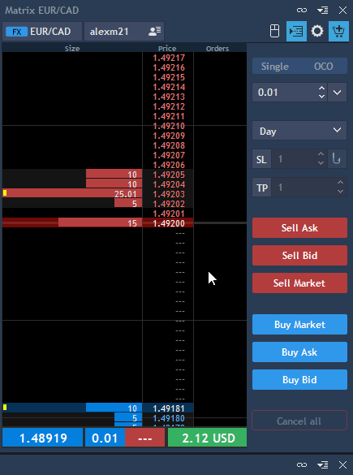
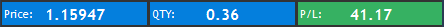
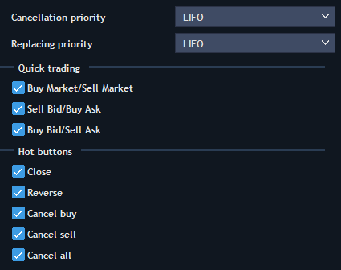
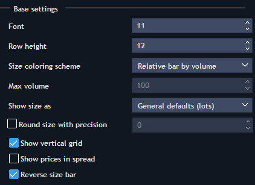
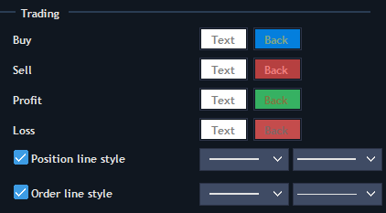

# Matrix


The Matrix panel is a simple way to trade and analyze level II quotes simultaneously.

To open a new Matrix panel, go to Terminal -> Matrix:


The top panel of the Matrix consists of the Symbol and Account lookups, trading button and Menu button.

.jpg>)

* Compress spread – allows skipping empty levels between the best bid and best ask;
* Recenter button – allows manually recentering the panel relatively to spread;
* Mouse trading button – allows one-click trading with the help of the mouse;
* Settings – allows to open Matrix settings window.

The bottom position bar shows the current state of the position: open price, opened position quantity, current profit and loss.

P/L value is displayed in currency or in ticks/points depending on what option you choose clicking on it.

Selection between 'P/L by currency' and 'P/L by points' is available when 'Show offset in = Points' in the section 'Trading defaults' of the 'General settings'.

Position bar has extended functionality for Multiple position mode:

When clicking the Price value, one of two options can be selected: Average open price or Break-even.

Break-even = (Long qty.\*Average long – Short qty.\*Average short)/(Long qty. – Short qty.)

When clicking on QTY value, one of two options can be selected: Net QTY or Gross QTY.

1. Net QTY = Qty1 + Qty2 + Qty3
2. Gross QTY = |Qty1| + |Qty2| + |Qty3|

The color of QTY cell depends on the side of the position:

1. If all positions have Side = Long, qty. cell will be colored in blue;
2. If all positions have Side = Short, qty. cell will be colored in red;
3. If positions are multidirectional, then qty. cell is not colored;
4. If there are no positions, qty. cell will not be colored and qty. value = N/A.

* When trading multi-position symbols, open price of all the positions is calculated as weighted average value;
* The Orders column shows all pending orders and allows their modification. Limit orders are displayed as numbers, and Stop orders - as underlined numbers. Group of orders is displayed with two vertical lines of the pending order left side;
* The Size column shows how many trade operations with Ask/Bid are available at a specific price;
* Clicking on Cancel buy, Cancel sell, or Cancel all will close all buy, sell, or total orders respectively for the currently displayed symbol and account;
* Close position button allows closing the current position by selected symbol and account.


On the right side of the Matrix panel there is a built-in Order entry panel. The order amount can be specified on the top of panel. Also the Validity of the order, SL/TP offset and Trailing stop.

Click on Buy Market or Sell Market to Buy/Sell at market price.

**Mouse trading** – allows trading using mouse (when the corresponding button is activated on the top of the panel). With left mouse click you can place Buy orders, with right click – Sell orders. You can switch the order type from Limit to Stop using the hotkey "Shift" (can be changed in General settings - > Hotkeys - > Matrix). 

There is also a separate flow for placing OCO orders in the Mouse trading mode. To place a Buy OCO order in the Matrix panel, the User should first left-click on the desired price - the first leg of the Limit order will be set, and without releasing the mouse button, move the pointer over the needed Ask price level, then release it, the second leg of the Stop order will be set. In order to place a Sell OCO order, use the right mouse button and repeat the above flow.

Mouse trading rules:

* When sliding with cursor within any item in the Market depth section the whole row should be highlighted (volume value/price);
* If there is no order on current price, it can be exposed by clicking on any area of a given row;
* If there is an order on current price, then you can open a new one by clicking on price and volume area;
* If an order is open on current price, then clicking (with any button) on it (in orders area) will lead to its closure;
* If several orders are open on current price (summary volume is shown in the orders area), then when canceling the order the first exposed order will be cancelled in the first place.

### Data source 

In the Matrix panel a user can see the the extended information about the source of Last, Bid and Ask prices. In order to open the table with the detailed information, click on thearrow and the widget will be shown:

### **Matrix settings**

Matrix settings have three sections to setup.

**General**

.jpg>)

* Line types, colors and steps for the horizontal grid that are used in the panel can be set here. General color of the panel background is also set here;
* Recenter – if checked, then re-centering will occur when hovering the cursor over the panel area;
* Recenter type – allows selecting the recenter type: by Ask, Bid or Bid (+ Ask)/ 2.
* Show toolbar – allows showing toolbar.

**Trading**

* Cancellation priority – allows setting the priority for canceling orders in group (FIFO, LIFO);
* Replacing priority – allows setting the priority for replacing orders in group (FIFO, LIFO).

Check/uncheck the needed hot buttons in order to display them in the Quick OE section of the Matrix panel:

* Buy Market/Sell Market;
* Sell Bid/Buy Ask;
* Buy Bid/Sell Ask;
* Close;
* Reverse;
* Cancel buy;
* Cancel sell;
* Cancel all.

**Market depth**

Base settings:

* Standard settings – Font, Row height;
* Size coloring scheme – allows selecting the coloring scheme of volume indicators:

Relative bar by volume – under this scheme the cell with maximum volume is colored entirely, the others are colored as a percentage from its volume;

Relative bar by custom volume – if selected, the Max volume field is activated where you can set the volume value as a percentage of which the coloring of each cell is calculated;

Relative by volume – all cells are colored entirely, the color saturation depends on volume. Cell with maximum volume will be colored in the most saturated color;

Relative by custom volume – all cells are colored entirely, the color saturation depends on value which is set in the Max volume field.

* Show size as – allows selecting in what form the volume will be shown. General defaults – is taken from general settings; Lots – will be displayed in lots; Real size - will be displayed in real value;
* Round size with precision – if checked, you can set the precision of the volume display;
* Show vertical grid – if checked, the separator is shown between column Volume and column Price;
* Show prices in spread – if checked, price values are shown in the spread; if unchecked – dashes;
* Reverse size bar – if checked, size of quantity indicators will be filled from right to left; if unchecked – from left to right.

Additional settings:

* Hover – color and line types settings when sliding the cursor through each price level;
* Grid – color of the vertical grid in the Market depth section.

Coloring scheme:

* Color settings for filling the volumes by Ask and Bid;
* Color settings for max volume markers.

Lvl. 2 colors:

* Color settings for the prices column;

Color settings for Best ask and Best bid rows.

Trading:

Color and line types’ settings for established orders and positions.

* Buy/Sell color settings – change colors in the Position bar (Price and QTY), when positions are Long/Short;
* Profit/Loss color settings – change colors in the Position bar (Price and QTY), when P/L is positive/negative.

### **Matrix hotkeys**

The list of hotkeys to set for the Matrix panel is available in the General settings - > Hotkeys - > Matrix.

Matrix hotkeys have the following functions:

*
  Cancel all active orders on selected instrument – allows cancelling all active orders on the selected instrument;
*
  Cancel last order on selected instrument – allows cancelling last order on the selected instrument;
*
  Cancel Buy order(s) closest to the last price – in case of existence of two orders of different price, the order which is closer to the last price is cancelled. In case of existence of two or more orders of the same price, all orders are cancelled because they are equidistant from the last price;
*
  Cancel Sell order(s) closest to the last price – in case of existence of two orders of different price, the order which is closer to the last price is cancelled. In case of existence of two or more orders of the same price, all orders are cancelled because they are equidistant from the last price;
*
  Modifier: Stop order when mouse click – allows stopping the order when mouse click;
*
  Modifier: Group actions with orders – allows grouping actions with orders;
* Set recenter type to Bid (+Ask) / 2 – allows setting the Bid (+Ask) / 2 recenter type;
* Set recenter type to ask –** **allows recentering the panel relatively to Ask;
* Set recenter type to bid – allows recentering the panel relatively to Bid;
*
  Set qty. equal to opened position's qty. – allows setting quantity equal to opened position’s quantity.
