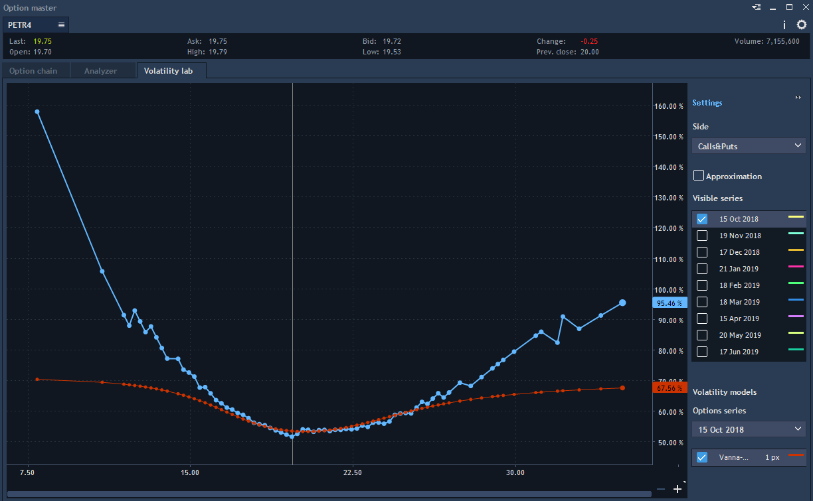
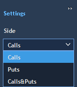
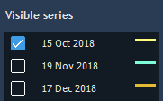
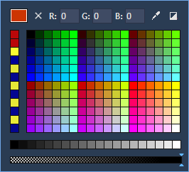
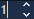
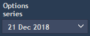
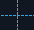
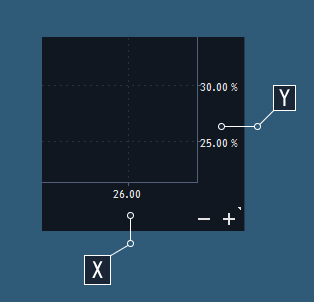

# Volatility lab

Volatility lab tab is used for graphic analysis before starting to trade options:


This tab allows plotting the "Volatility lab" which is considered as a totality of IV values for a specific option contract. Also, it is possible to plot "Volatility lab" graph according to actual market data and Vanna-Volga implied volatilities model.

See the blue chart for "Volatility lab" plotted according to actual market data and the red one for Vanna-Volga implied volatilities model on the chart below:

### **Vanna-Volga implied volatilies model calculation algorithm**

This model is plotted for selected option series and gets the following elemental parameters:

* Days to expire of selected option series – Days/365;
* Underlier price – can be Forward or Current last price, is calculated with taking into account interest rates.

If Forward price is selected in the settings, then Forward price is calculated this way:

Forward price = Current last price \* e^\(M\*Days/365\), where

M = Domestick rate/100 - Foreign rate/100;

* ATM strike – is a strike, value of which is the closest to a Current last price value;
* ATM IV – an arithmetic mean of ATM Call and Put strikes IV;
* D Call strike – is a Call strike, Delta absolute value of which is the closest to a Delta value in the settings; 
* D Call IV - D Call strike IV;
* D Put strike - is a Put strike, Delta absolute value of which is the closest to a Delta value in the settings;
* D Put IV - D Put strike IV;
* Strikes array of selected option series.

  These parameters are used in array’s model values IV calculation for selected option series.

  The calculated series are reflected on the Volatility lab chart.

### 
**Chart settings menu**

In the Chart settings menu you can choose the Side, Visible series and Volatility models to be displayed on the chart:

In order to hide the Chart settings menu, press the button, this will result into the chart’s maximization.

* The drop-down list in the Side section allows selecting an option side \(strikes\) on which the "Volatility lab" will be plotted. Available strikes are Calls, Puts, Calls&Puts:

* The section Visible series allows selecting series for "Volatility lab". Mark series as checked to get one or more "Volatility lab" graphs plotted on the chart:

* Pressing
  allows to define graph’s thickness \(from 1 to 10 px\), and pressingcalls the dialog window for graph’s color selection:

Marking the optionas checked in the Volatility models section allows to plot Vanna-Volga implied volatilities model.

 This graph can also get its individual parameters via thickness and color selection \(,\). 

* The drop-down list of the Option series section allows selecting an appropriate series for Vanna-Volga implied volatilities model:.


Be attentive to choose the same series for Vanna-Volga implied volatilities model as for “Volatility lab” graph plotted according to actual market data.

### Chart scaling

 The chart view can be manipulated with the buttons, 
located in the buttom-right corner of the chart field: 

* Pressing the buttonallows to zoom out of any random area of the chart;
*  Pressing the buttonallows to zoom in to any random area of the chart;
*  Pressing the button
  allows to enable selecting any area of the chart for zooming in. Pressing this button again disables this option.

The chart view can be also manipulated with some additional options:

* Hovering the cursor over a chart’s dot + mouse wheel scrolling - allows zooming in to and zooming out of a chosen dotof any chart;
*  Clicking + holding + moving the cursor on a random area of the coordinate plane- allows to focus the chart view on this area of the coordinate plane;
* Clicking + moving the cursor on any area on the X or Y axis - allows to move on the left/right \(X\) or up/down \(Y\) on this area on the X or Y axis;
* Clicking + scrolling on any area on the X or Y axis - allows to zoom in to and zoom out of this area:

