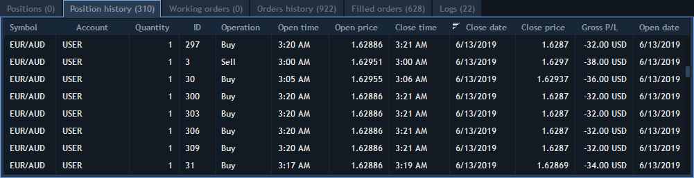

# Orders & Positions history

### **Orders history**

Orders history panel shows all orders sent during the backtesting.

The following columns are available for the panel:


Customer can also use standard functions from context menu of the panel:

* Clear – allows deleting all orders from the panel;
* Search – allows to show/hide a Search lookup in the panel;
* Export – allows to export table to CSV or Excel format;
* Group by – allows to group orders by symbol, account, side, event, type, date/time, bought, sold.

### **Positions history**

Positions history panel shows positions which were opened for a certain period during the backtesting. History range can be set in Backtesting setup -&gt; Range.


The following columns are available for the panel:


For this panel the same functions as for Orders history are available in context menu.

