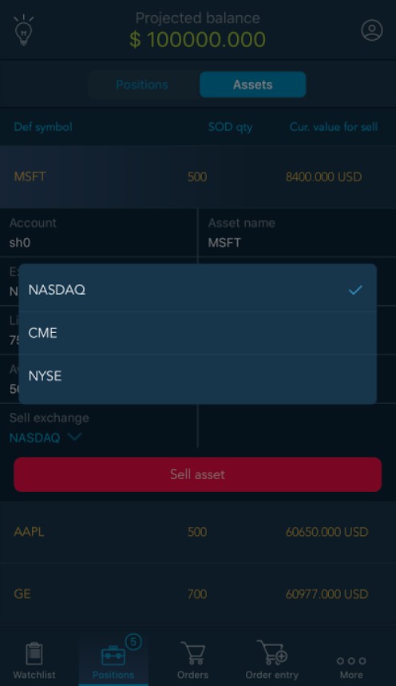

# Assets

Assets screen contains information about all assets by the chosen account\(-s\). If different accounts have the same asset, then it is displayed in different rows in the table.

Assets screen can be accessed from Positions screen by moving the slider button to Assets.

For each asset the following information is available:

* Default symbol – allows showing the instrument name from the setting ‘Pricing instrument’.
* Start day qty. \(SOD qty\)  – asset quantity at the user’s account at the beginning of a day. While logging in it is sent from a server.
* Current value for sell – allows showing the price of the asset, which is available for the sell by Current price.

Current value for sell = Available for sell \*Current price \* CrossPrice

When viewing an asset, the user can sell it or quickly switch to the chart to assess its current state and return back to the selected asset. In order to do this swipe left the card of the selected asset and the following buttons will become available:

To quickly go to the chart or sell the asset, just tap the corresponding icon. To return back to the order, tap the ‘Back’ button depicted as an arrowin the upper left part of the chart.

To open additional data by the chosen asset, tap on it and the table with data will be displayed.

There are the following information is available in the table:

* Asset name – name of the asset, which is set on a server.
* Exchange – allows showing the exchange which is set on a server for the Default symbol.
* Account – name of the account, which contains the asset.
* Start day Qty. for Margin available – while logging in, the user gets information from the correspondent field on a server.
* Liquidity rate% – the price of each asset at the user's account can be used for the opening of a position by other instruments. This price should be counted in Margin available in that interest proportion which is defined in this setting. Default value is 0. Maximal value is 100.
* Intraday qty. – the quantity of the asset which was traded by all instruments for which this asset was pre-selected, but only for Product type=Delivery. The quantity of all Buy trades is counted with ‘+’, the quantity of all Sell trades is counted with ‘-‘.
* Available qty. – quantity of the asset, which is available for sell.

If Today traded qty.&gt;=0, then Available for sell = Start day qty.

Otherwise, Available for sell = Start day qty. - \|Today traded qty.\|

* Current price – current Last price on the instrument Default symbol.
* Sell exchange – allows showing a list of all exchanges where the asset is traded. 

‘Sell asset’ button allows to launch Order entry in order to sell asset.

