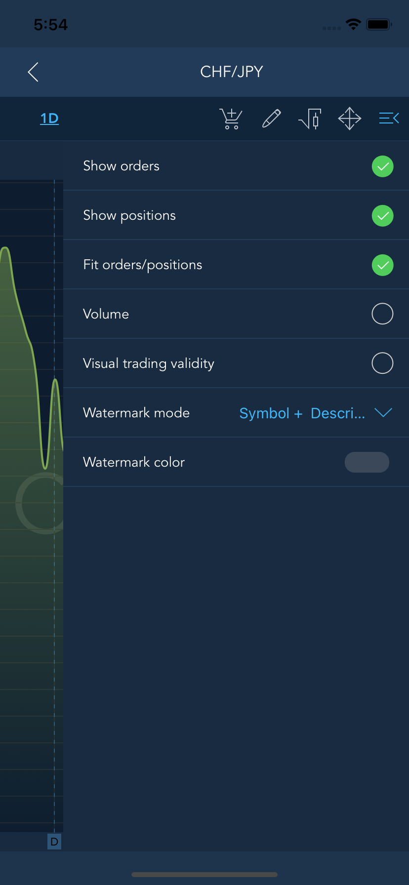

# Chart


The Chart screen is the most important tool for active trading and market analyzing. The Chart screen can be accessed only from the Watchlist screen.


In the ‘Indices’ section swipe left or right the chart to change the symbol and choose the time frame.

Tap the name of the symbol at the list of added symbols to open the chart:

### 
**Chart toolbar** 

Tap the button
to open Chart toolbar.


The Chart toolbar consists of 3 items:

* Chart style – allows to choose the style of the chart. Available chart styles: Line, Candle, Area;
* Chart templates – allows to create a chart template;
* Settings – allows to open the Chart settings screen and configure the following items:

### **Indicators**

In order to add a new indicator, choose the category of indicators \(Channels, Moving averages, Oscillators etc.\) and tap the buttonnear the indicator name at the list of available Indicators.


It will appear in ‘Added indicators’ section and you can set indicator’s parameters by tapping the button. 
Tap the buttonlocated near indicator’s name to remove indicator from this section. 


Open the chart to see the added indicators.

### 

**Order entry**

 The Order entry screen enables user to send orders. The Order entry icon
is located at the top right corner of the Chart screen.


Read more information about Order entry screen here:

[https://guide.traderevolution.com/project/mobile-applications/ios/phone/order-entry](https://guide.traderevolution.com/project/mobile-applications/ios/phone/order-entry)

