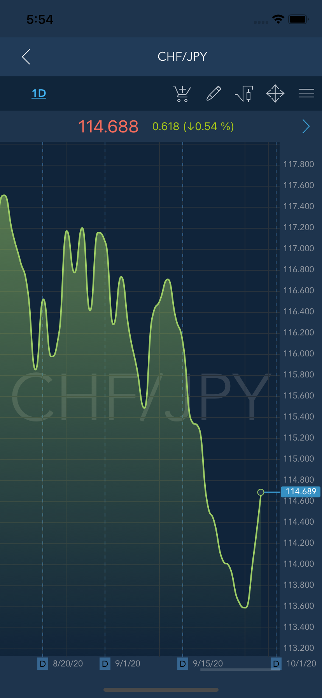
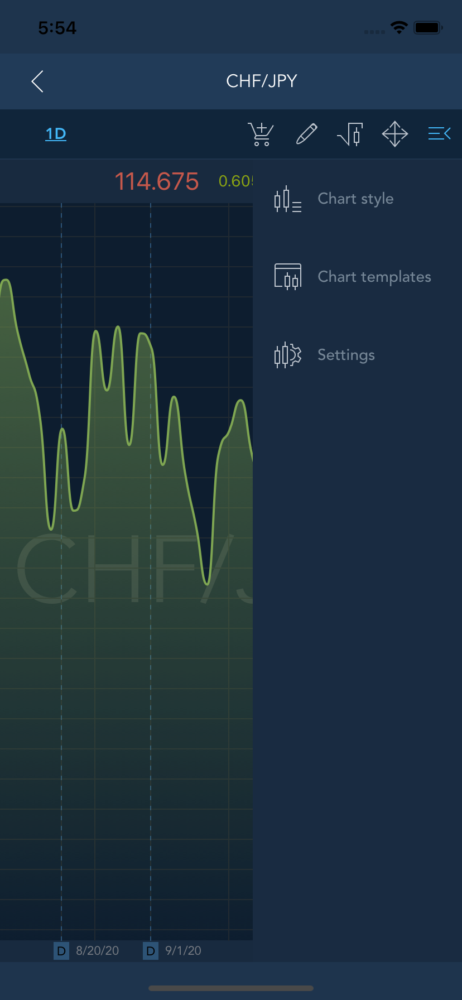

# Chart

The Chart screen can be accessed from the Watchlist screen. Also, it is possible to open a chart from the Orders, Positions, and Assets panels by swiping the desired instrument or asset to the left and tapping the ‘Chart’ button.


In the ‘Indices’ section swipe left or right the chart to change the symbol and choose the time frame.

Tap the name of the symbol at the list of added symbols to open the chart:

### 
**Chart toolbar** 

Tap the button
to open Chart toolbar.


The Chart toolbar consists of 3 items:

* Chart style – allows to choose the style of the chart. Available chart styles: Line, Candle, Area;
* Chart templates – allows to create a chart template;
* Settings – allows to open the Chart settings screen.

The following chart settings are available for configuration:

* Show orders – enables/disables the display of orders on the chart;
* Show positions – enables/disables the display of positions on the chart;
* Show alerts – enables/disables the display of alerts on the chart;
* Fit orders/positions – if checked, all orders/positions will be fit into chart scaling;
* Fit alerts – if checked, then alerts will be fit into chart scaling;
* Volume – enables/disables the display of volume on the chart;
* Visual trading validity – if checked, then the validity selection control will be present when placing an order in the visual trading mode;
* Watermark mode – drop-down list that allows to select one of the options that will be displayed as a watermark on the chart;
* Watermark color – allows selecting the watermark coloring;
* Show extended session**s** - allows seeing bars from extended sessions on chart. The peculiarities of this setting also depend on the state of the "Use session periods for Intraday chart" setting that can be found in the BackOffice. If “Use session periods for Intraday chart = true”, then the aggregation will start from the first session of the day. At the same time, sessions that belong to the Before market/After market periods will be excluded from the Extended session list.

### **Indicators**

In order to add a new indicator, choose the category of indicators \(Channels, Moving averages, Oscillators etc.\) and tap the buttonnear the indicator name at the list of available Indicators.


It will appear in ‘Added indicators’ section and you can set indicator’s parameters by tapping the button. 
Tap the buttonlocated near indicator’s name to remove indicator from this section. 


Open the chart to see the added indicators.

### 

**Order entry**

 The Order entry screen enables user to send orders. The Order entry icon
is located at the top right corner of the Chart screen.


Read more information about Order entry screen here:

[https://guide.traderevolution.com/project/mobile-applications/ios/phone/order-entry](https://guide.traderevolution.com/project/mobile-applications/ios/phone/order-entry)

### Drawings

A set of graphical tools is available to assist in price movements analysis:

All of these tools are accessible via the Drawings panel. In order to open this panel tap theicon. The following panel will be opened:

The following list of graphical tools is currently available:

Added drawings – this group includes all drawings that were added to the chart for the selected instrument. Opposite each drawing in this group there are controls:

* Settings - tap to open the drawing settings;
* Remove - tap to remove the drawing from the chart.

Recently used – group that contains the 5 last used drawings.

Fibonacci drawings:

* Fibonacci retracement – retracement and price goals;
* Fibonacci expansion – estimating support and resistance levels;
* Fibonacci fans – places Fibonacci angles;
* Fibonacci phi-channel – places Fibonacci levels on a trend line;
* Fibonacci time goal analysis – places time goals.

Gann drawings:

* Gann line – places a line drawn at the angle of 45 degrees;
* Gann fan – places a series of diagonal lines;
* Gann grid – places trends at the angle of 45 degrees.

Lines drawings:

* Horizontal line – places a horizontal line on the chart;
* Vertical line – places a vertical line on the chart;
* Line – places a line on the chart;
* Price channel – places levels on a trend line;
* Andrew's pitchfork – places Andrew's channel Polygon.

Polygon drawings:

* Rectangle – places a simple rectangle on the chart;
* Triangle – places a simple triangle on the chart.

In order to place a tool:

* Open the Drawings panel and select the desired drawing tool;
* If a tool requires points to be specified on the chart \(e.g. a line requires two points while Andrew's pitchfork requires three\), the user can place these points on the chart by tapping the required places.

#### Settings

Each drawing has its vertical Settings bar:

This bar allows the user to configure the following settings:

* Line thickness;
* Line type;
* Line color;
* Add a color fill to the drawing;
* Lock/unlock the drawing on the chart;
* Open the menu that allows to adjust the levels of drawing, extend it to the left or right side, and select the time and price plotting points;
* Delete the drawing.

By pressing the top of the menu, the user can move it within the chart to any convenient place.

