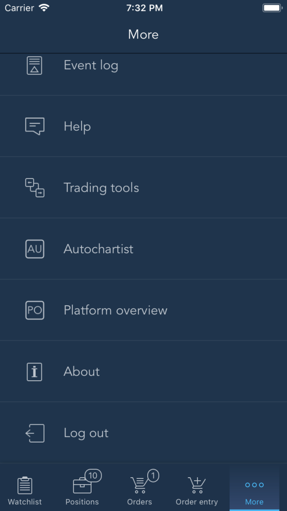

# More

In this tab menu, users can access the app settings, view the app info and use additional features:

* Settings – allows accessing the app settings;
* Event log – opens the app event log;
* Help – opens the help menu;
* About – allows viewing the app version info;
* External link – when configured in the Back Office, allows opening an external link content in a dedicated detachable panel named after the link text.

