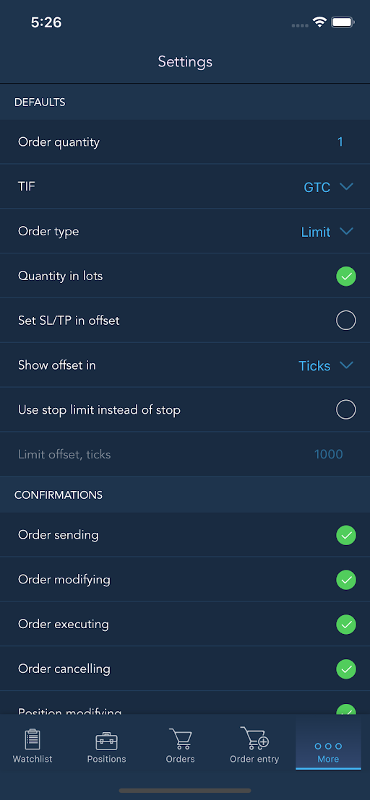
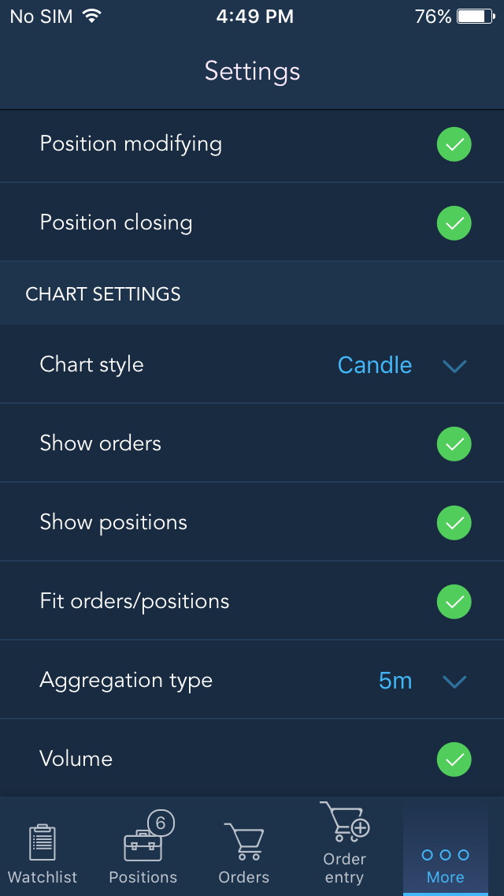

# Settings

You can access the ‘Settings’ screen from the application's ‘More’ menu in order to manipulate by 'Defaults', 'Confirmations' and 'Chart settings':

### 
**Defaults**

In ‘Defaults’ settings section you can adjust the following:

* Order quantity – displays amount of lots for opening an order;
* TIF \(Time-in-force\) – allows to specify order activation time-frames by selecting among the following: Day, GTC, IOC, FOK, GTD;
* Order type – allows to select one of the following orders: Market, Limit, Stop, Stop limit, Trailing stop;
* Quantity in lots - if checked, quantity is displayed in lots, if unchecked – in units;
* Set SL/TP values in offset – if checked, the SL/TP prices are in offset, if unchecked they are in absolute values;
* Show offset in – allows to select one of the available modes for offset displaying: Ticks, Points;
* Use stop limit instead of stop – check to place stop limit orders instead of stop orders. When checked, ****it activates the 'Limit offset, ticks' field.

### **Confirmations**

‘Confirmations’ settings section allows to enable double-checking of the following actions by marking them as checked, after what the application will ask you to confirm these actions:

* Order sending;
* Order modifying;
* Order executing;
* Order cancelling;
* Position modifying;
* Position closing.

### **Chart settings**

‘Chart settings’ section allows to specify the following options to be visible on the chart:

* Chart style: Candle, Line, Area;
* Show orders – mark as checked to visualize all sent orders;
* Show positions – mark as checked to visualize all opened positions;
* Fit orders/positions – if checked, orders/positions will be visible on the Chart that automatically scales;
* Aggregation type – allows you to select representation type of data on the chart \(e.g. 1 Bar = 1 minute\);
* Volume – if checked, traded volume bars are shown on the chart.

