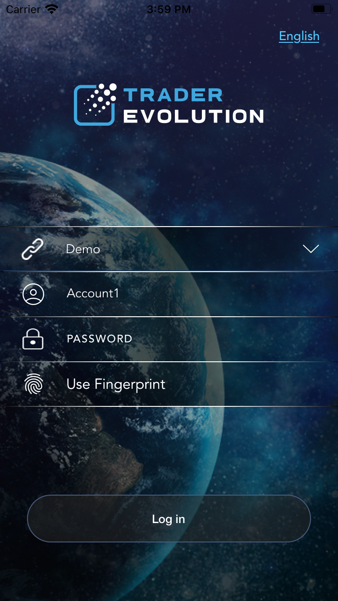
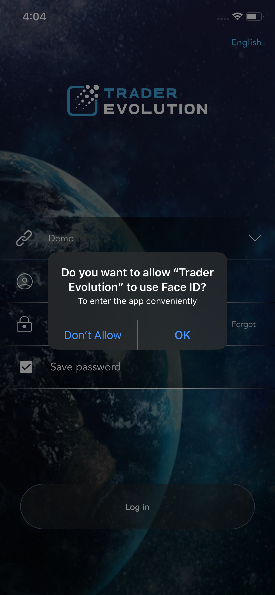
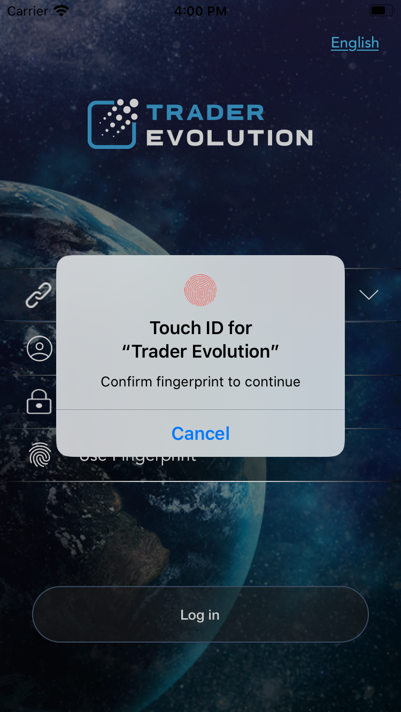

# Settings

You can access the ‘Settings’ screen from the application's ‘More’ menu in order to manipulate by 'Defaults' and 'Confirmations':

### 
**Defaults**

In ‘Defaults’ settings section you can adjust the following:

* Order quantity – displays amount of lots for opening an order;
* TIF \(Time-in-force\) – allows to specify order activation time-frames by selecting among the following: Day, GTC, IOC, FOK, GTD;
* Order type – allows to select one of the following orders: Market, Limit, Stop, Stop limit, Trailing stop;
* Quantity in lots - if checked, quantity is displayed in lots, if unchecked – in units;
* Set SL/TP values in offset – if checked, the SL/TP prices are in offset, if unchecked they are in absolute values;
* Show offset in – allows to select one of the available modes for offset displaying: Ticks, Points;
* Use stop limit instead of stop – check to place stop limit orders instead of stop orders. When checked, ****it activates the 'Limit offset, ticks' field.

### **Confirmations**

‘Confirmations’ settings section allows to enable double-checking of the following actions by marking them as checked, after what the application will ask you to confirm these actions:

* Order sending;
* Order modifying;
* Order executing;
* Order cancelling;
* Position modifying;
* Position closing.

### Other

The **"**Other" settings section cannot be displayed in the application settings if the biometric authentication is not checked in the system settings of the device or it is blocked. 

Biometric authentication enables a user to log in to the mobile application more securely by using the Fingerprint or FaceID features.

To apply Fingerprint in the application for subsequent logins, a user should put his finger on the sensor.

After this, the checkbox More -&gt; Settings -&gt; Other -&gt; Biometric authentication becomes True. On subsequent calls of the Login screen form, if the Biometric authentication setting is checked in the application, then the following dialog box is automatically displayed:

The user authentication occurs after putting a finger on the sensor and successful fingerprint recognition.

In case the FaceID feature is available and activated on the user device, it can be used as an additional application login option instead of the Fingerprint.

