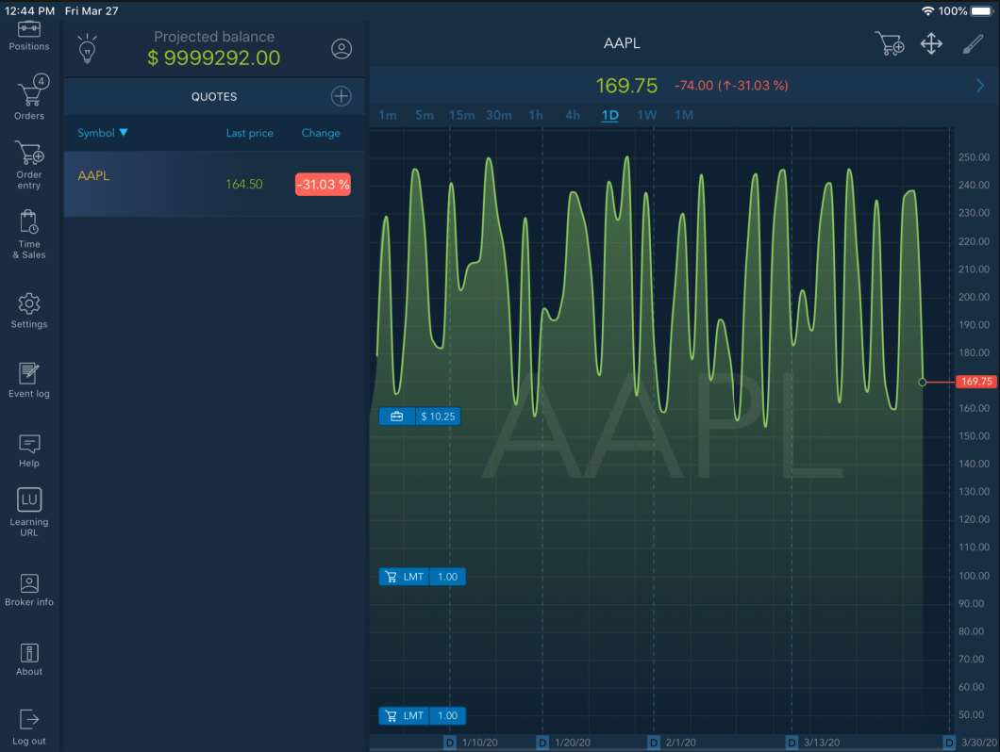

# External links

Users can access external links via the application menu:

When configured in the Back Office, external links are displayed after the "About" menu item. External link names are based on their content and are displayed under the icons. Clicking such icon opens a dedicated panel with an external link content.

