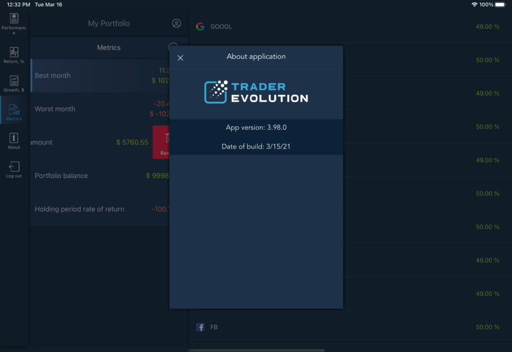

# More

All customers can use the auxiliary functions when working with My Portfolio. The following functions are available:

* About - allows viewing the application version info;
* Log out - allows logging out of the application.

