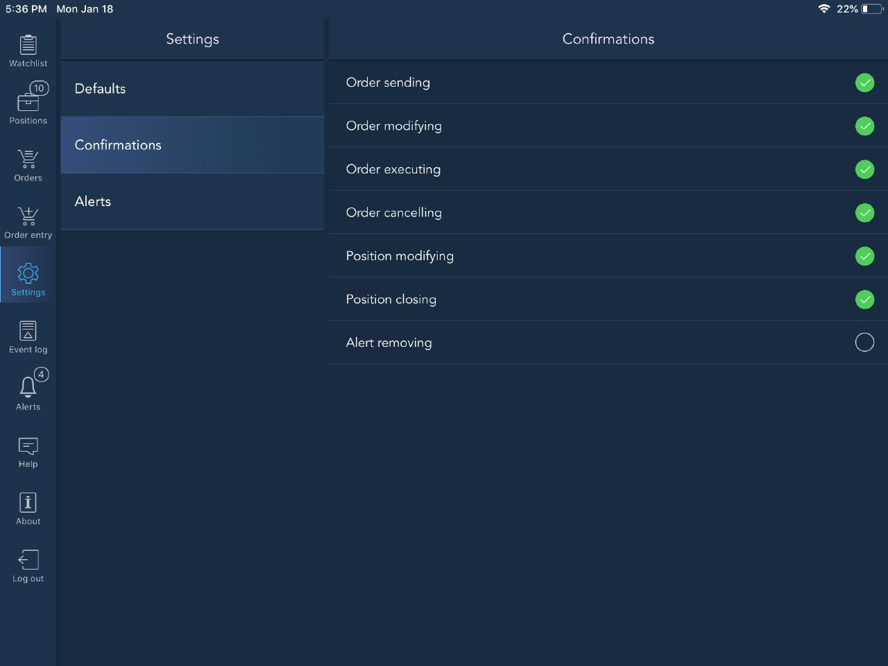
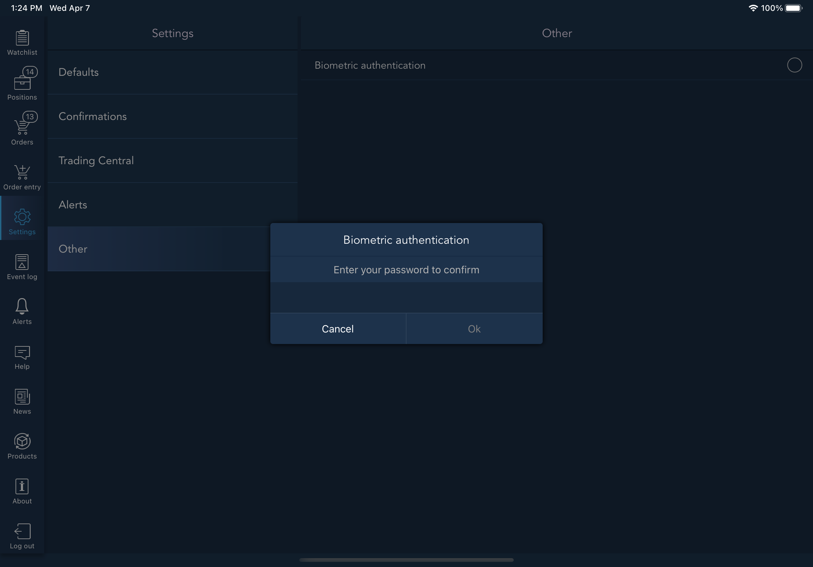
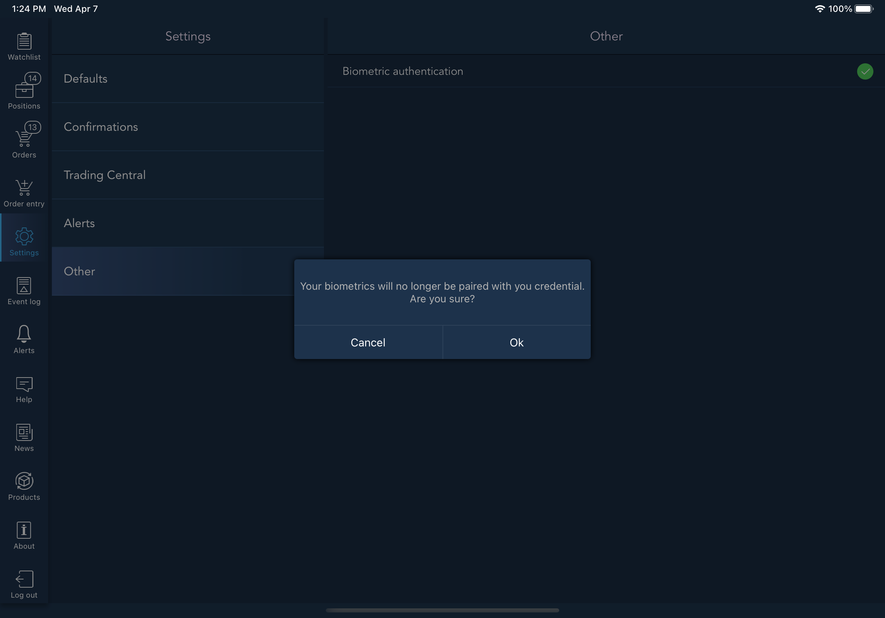
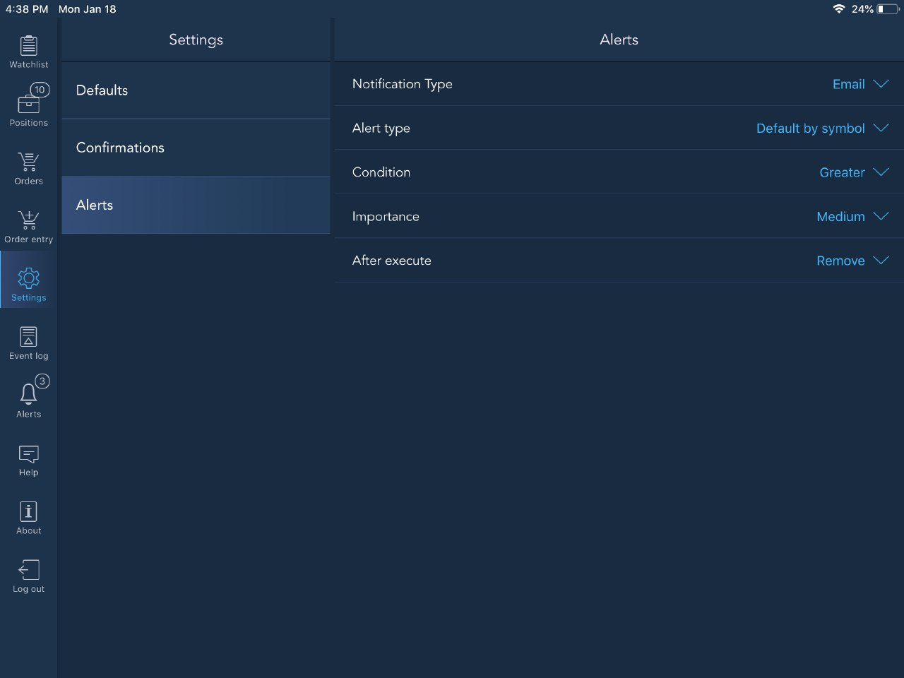

# Settings


You can access the ‘Settings’ screen from the application's main menu in order to manipulate by 'Defaults' and 'Confirmations':

### **Defaults**

In ‘Defaults’ settings section you can adjust the following:

* Order quantity – displays amount of lots for opening an order;
* Validity – allows specifying order validity by selecting among the following time frames: Day, GTC, IOC, GTD, FOK;
* Order type – allows to select one of the following orders: Market, Limit, Stop, Stop limit, Trailing stop;
* Quantity in lots - if checked, quantity is displayed in lots, if unchecked – in units;
* Set SL/TP values in offset – if checked, the SL/TP prices are in offset, if unchecked they are in absolute values;
* Show offset in – allows to select one of the available modes for offset displaying: Ticks, Points.

### **Confirmations**

‘Confirmations’ settings section allows to enable double-checking of the following actions by marking them as checked, after what the application will ask you to confirm these actions:

* Order sending;
* Order modifying;
* Order executing;
* Order cancelling;
* Position modifying;
* Position closing;
* Alert removing.

### Other

The **"**Other" settings section cannot be displayed in the application settings if the biometric authentication is not checked in the system settings of the device or it is blocked. 

Biometric authentication enables a user to log in to the mobile application more securely by using the Fingerprint or FaceID features.

To apply Fingerprint in the application for subsequent logins, a user should put his finger on the sensor.

After this, the checkbox More -&gt; Settings -&gt; Other -&gt; Biometric authentication becomes True. 

A user should enter his password to confirm biometrics:

On subsequent calls of the Login screen form, if the Biometric authentication setting is checked in the application, then the following dialog box is automatically displayed:

The user authentication occurs after putting a finger on the sensor and successful fingerprint recognition.

In case the FaceID feature is available and activated on the user device, it can be used as an additional application login option instead of the Fingerprint. 

To deactivate Biometric authentication, uncheck the corresponding setting and then tap the "OK" button on the undermentioned screen:

### Push notifications

TraderEvolution app provides the ability to receive push notifications on numerous events such as the daily loss limit warning, margin warning, receiving a new trading idea, etc. Upon receiving a push notification, the user can tap on it and thus open the application. Sending push notifications to the device is regulated by your broker, i.e. you cannot activate this function by yourself. If the user wants to disable receiving push notifications, he can do it in the settings of his device.

### Alerts

This section allows to configure the alerts, the following settings are available:

* Notification type – combobox for selecting the type of notification after alert triggering, multiselect is available:
  * Email – an alert containing the text from the ‘Alert message’ field will be sent to the user by email;
  * Push notification – an alert containing the text from the ‘Alert message’ field will be sent to the user via push notification;
  * Pop-up – an alert containing the text from the ‘Alert message’ field will be sent to the user in pop-up message;
  * Sound – a musical alert will be played to the user in the client.
* Alert type – allows to set an alert type. Available options are: Default by symbol, Ask, Bid, Last, Change%, Volume;
* Condition – allows to set an alert condition. Available values are: &gt;,&lt;,&gt;=,&lt;=;
* Importance – allows to define the alert importance, the following options are available: High, Medium, Low;
* After execute – allows to select alert behavior after execution. Available options are ‘Stop’ - alert is not active but stored in the list of alerts, and ‘Remove’ - alert is removed after execution.

