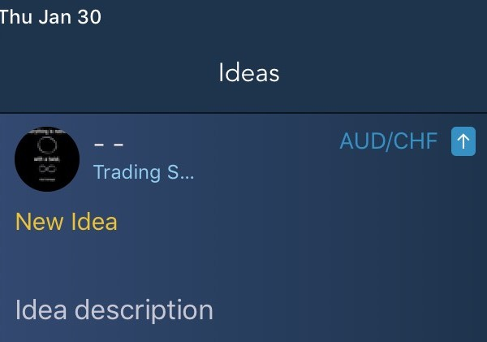
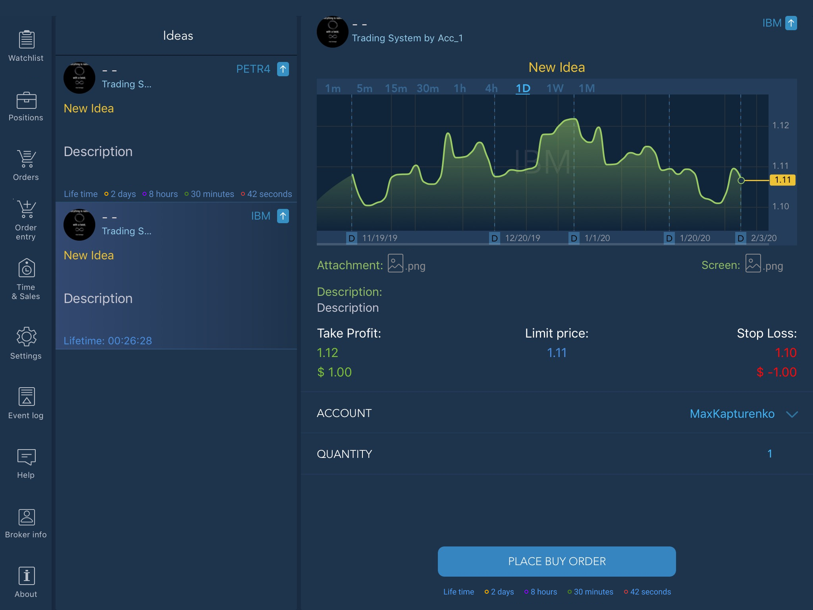
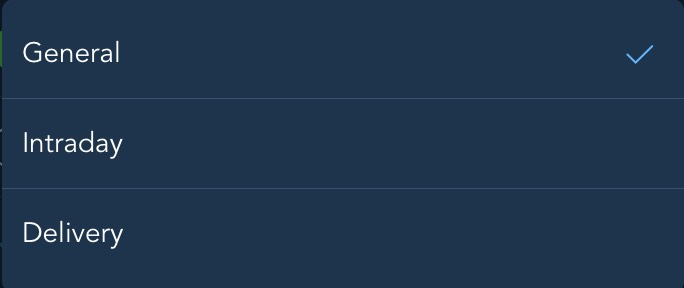
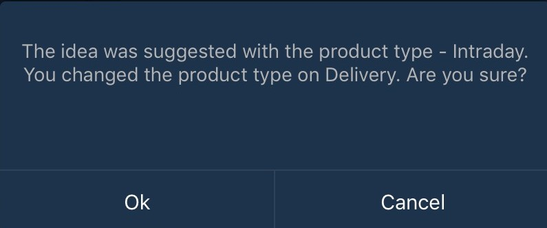
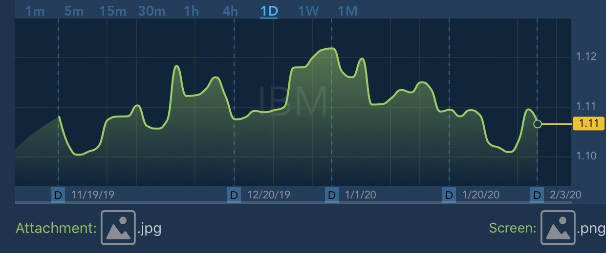
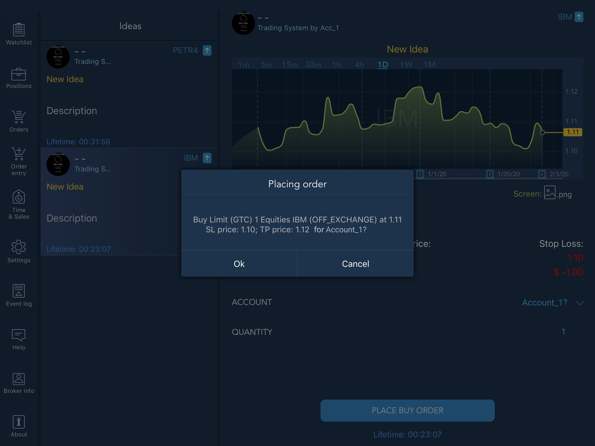

# Trading ideas

In the TE mobile application, Users \(Users-subscribers\) can receive and use [Trading ideas](https://guide.traderevolution.com/project/desktop-application-for-windows/windows/trading-ideas) or simply Ideas created by other Users \(Users-analysts\) in the TE Desktop application.


To be able to receive, view and use Ideas, a User-subscriber needs to be subscribed to a Trading system. Also, to receive Ideas and place orders based on Ideas received, the Instrument used in the idea must be available to the User.


A User-subscriber is notified of receiving an Idea by the  icon in the left upper corner of the main application menu. The number displayed on the icon means the number of Ideas received.

Clicking the icon opens the Ideas panel, which shows all the currently received Ideas:

By clicking on an Idea space in the Ideas panel, User can open the Idea expanded view and see its details:

The expanded view of an Idea contains the chart of the Instrument used \(if the data on the Instrument is available to the User\), Idea text description, remaining lifetime, Take profit, Limit price and Stop loss values and the Idea remaining Life time. With that, the chart of the Instrument used in the Idea is refreshed with the same frequency as the chart panel. 

In the Idea expanded view, the User-subscriber can specify the quantity for the Idea order using the Quantity control, view and change the Product type \(if available\) before placing the order.


If, in addition to the one specified in the Idea, there is a product type available to the User-subscriber that differs from the one specified in the Idea by the User analyst, the User subscriber can switch from "Delivery" to "Intraday" product type using the Product type control:    
With that, the User is shown the product type change confirmation dialog:

 

If the User-subscriber has only one product type available and it differs from the one specified in the Idea, the User-subscriber can only view the product type without being able to change it.


Also, in the Idea expanded view, User can view an attached Chart snapshot and open the attachment file \(if they were added on the Idea creation\) by clicking the symbols near the "Screen" and "Attachment" items respectively under the Idea Chart:

Clicking on the “PLACE BUY/SELL ORDER” button displays the order placement confirmation dialog:

After clicking the OK button, the Idea order is placed and the User can manage it in the Orders menu.

