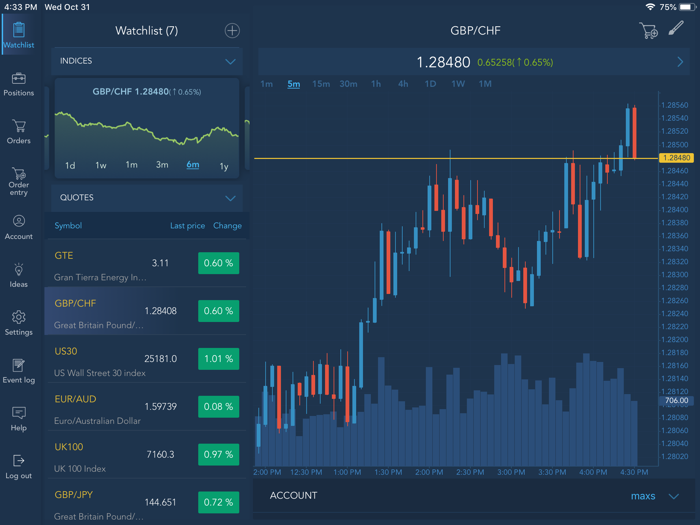
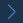
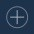
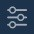

# Watchlist


The Watchlist screen is accessible by default after logging in to the application.


In the Watchlist you can find information by traded symbols:

* Last price – the last trade price;
* Change, % – the price deviation from current day's opening price in a percentage.

In order to get full symbol information and open the chart, tap the Symbol name. Tap the button
at the top right corner of the Chart to open the Info window:

* Volume – the total amount traded today;
* Open – the day's open price;
* High – the day's highest price;
* Low – the day's lowest price;
* Previous close – the previous day's close price.

### 
**Symbol lookup** 

In order to open Symbol lookup, tap the buttonat the top right corner of the Watchlist. Check/uncheck the desired symbols. Selected symbols will automatically appear in the Watchlist.

### 
**Watchlist Filter** 

In order to filter the list of displayed symbols tap the button, 
located at the top right corner of the Symbol lookup. Choose the needed exchange and symbol group from the lists of available.

### 
**Symbol menu**

Swipe left the symbol name to open the Symbol menu toolbar.

                                                           

* Info – opens the Symbol info with full information about the symbol;
* Market depth – opens the level 2 quotes for the selected symbol;
* Order Entry – opens the Order entry screen for the selected symbol;
* Remove – allows removing the Symbol from the Watchlist.

