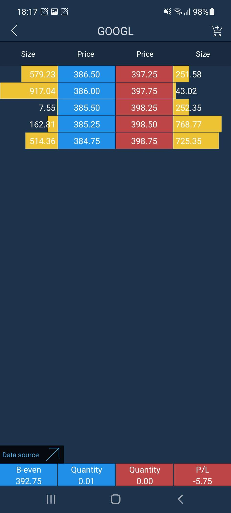
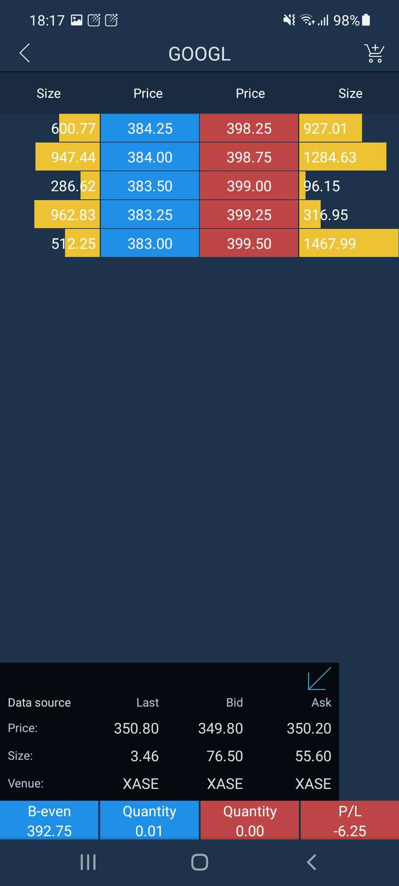

# Market depth

The Market depth screen allows users to view and trade Level II quotes. It is accessible only from the Symbol menu in the Watchlist screen. Open the Watchlist and swipe left the selected instrument name. Then tap the button 'Market depth' in the Symbol menu.

                                                       .png>)                          

The main quote section consists of the following columns:

* Price - buy or sell price from the highest Bid and the lowest Ask to lower Bid and higher Ask.
* Size - the volume being offered to purchase at a specified Bid price or to sell at specified Ask price.

The best Bid and best Ask prices are located at the top of the histogram. Volumes are located opposite to the corresponding prices.

To open Order entry screen, tap the Order entry button.png>)at the top right corner of the Market depth screen. Also you can open the Order entry screen by tapping the Bid/Ask row. The chosen BID/ASK price is placed as a limit price in OE automatically.

.png>)

Read more about the Order entry screen here:

[https://guide.traderevolution.com/project/mobile-applications/phone/android/order-entry](https://guide.traderevolution.com/project/mobile-applications/phone/android/order-entry)

### Data source

In the Market depth panel a user can see the the extended information about the source of Last, Bid and Ask prices. In order to open the table with the detailed information, tap the.jpeg>)arrow and the widget will be shown:

