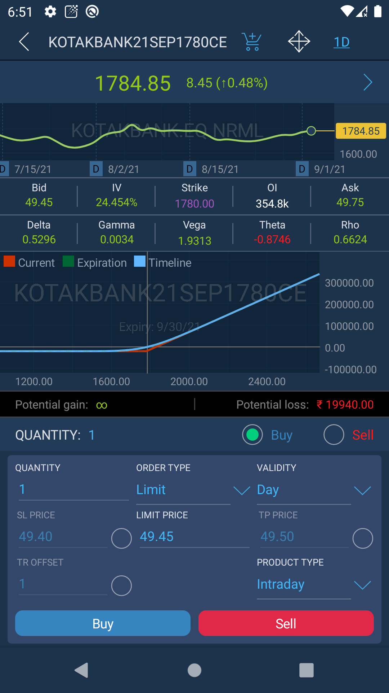

# Option chain

The Option chain screen shows detailed information about a specific option contract and allows a user to trade from this panel. 

Swipe left the instrument at the Watchlist screen and select the corresponding item to open the Option chain panel.

Under the header of the Option chain screen a user can see the Info bar which displays the following data:

* Last - last price by underlier;
* Change, % - change in percentage by underlier;
* Volume - volume by underlier;
* Previous close - the previous day's close price.

The Option chain table contains 3 columns:

* Calls - this column shows the cards of Call strikes that display the following information: Ask, Bid, IV, OI \(Open interest\), Change. Other parameters can be configured in the Panel settings;
* Strike - the Strike price;
* Puts - this column shows the cards of Put strikes that display the following information: Ask, Bid, IV, OI, \(Open interest\), Change. Other parameters can be configured in the Panel settings.

In Option chain panel the coloring method “By difference” is used. Depending on what type of price change comes at a certain strike to buy or sell, it is highlighted in green or red.

IV \(Implied volatility\) column shows the expected volatility of the option which characterizes the degree of underlier price volatility. If IV is high, strong fluctuations of underlier price are expected.

The Open interest column shows the total amount of open positions.

The undermentioned screenshot shows the filter by the number of displayed strikes:

### Underlier chart and Profile

By tapping the option card in the Option chain panel, a user will get to the graphical data section, where the underlayer's charts and the option profile are displayed.

Greeks are the coefficients used for the characteristics of option cost sensitivity to the changing of various values: Delta, Gamma, Vega and Theta.

* Delta – is the first derivative of the option price by the underlier price; shows how option price will be changed in points, if the underlier price changes by 1 point.
* Gamma – is the second derivative of the option price by the underlier price; shows the rapidity of the option delta change.
* Vega – is the first derivative of the option price by volatility; shows how option price will be changed in points, if the volatility changes by 1%.
* Theta – is the first derivative of the option price by time; shows how the option price will be reduced after one day.

To send orders from the Option chain panel, open Order entry by tapping thebutton ****at the top right corner of the Chart screen:

### **Settings**

In order to manage the panel settings, tap the  button and the following screen will be opened:

A user can configure settings in the “Column editor”, “Calculations” and “Analyzer” sections.

* Column editor - in this section a user can activate/deactivate the necessary parameters for displaying in the Call and Put options card;
* Calculations - this section contains parameters that will affect the calculations;
* Analyzer - this section contains a setting that allows a user to choose the chart type and the settings that are used to calculate the option profile.

