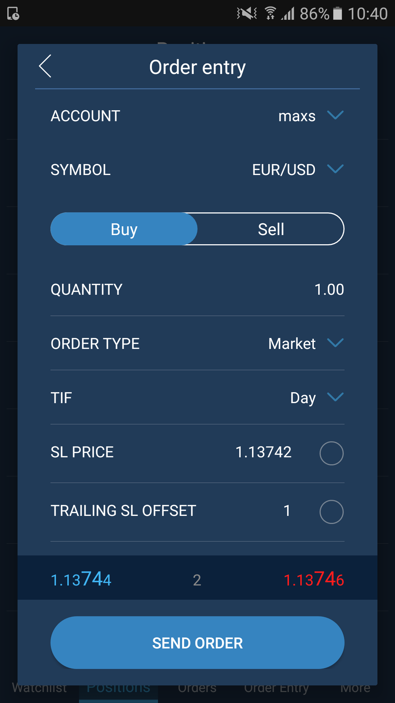

# Order entry

The Order entry screen enables users to send orders. The Order entry buttonis located at the top right corner of the Chart screen. Also it is accessible from the main menu located at the bottom of the application or from the Symbol menu. Swipe left the Symbol name in Watchlist to open Symbol menu and tap Order Entry button: 

                                                         


In Order entry users can see detailed information about the traded symbol: symbol name, quantity, order type, price, TIF and information about bid and ask. 

* Account – the account used for an order creation;
* Symbol – the symbol available for the trade;
* Side – allows to activate Buy or Sell side;
* Quantity – an amount of lots in which an order is placed. Tap the value in order to edit it;
* Order type – defines the type of the order: Market, Limit, Stop, Stop limit, Trailing stop:

