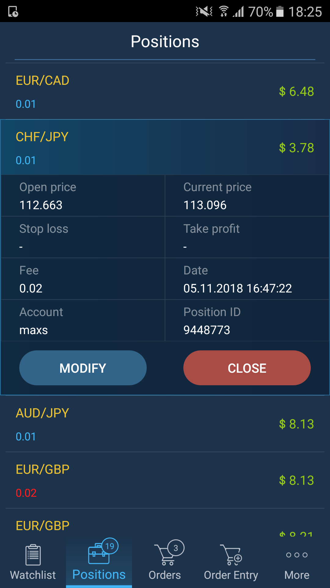

# Positions

The Positions screen displays all opened positions. Every new opened position appears in this screen immediately.


The Positions screen displays a list of opened positions with short information about a symbol on which every position was opened: quantity and open price. Quantity of long positions is blue, quantity of short positions – red.

In order to get full information about a symbol, tap a symbol's name.

* Fee – shows the total commission amount taken for a position;
* Date/time – shows date and time when a position was opened;
* Current price – market price obtainable from a broker;
* Stop loss – Stop loss price set for a position;
* Take profit – Take profit price set for a position;
* Position ID – unique number that the trading system assigns to each position;
* Open price – price at which the position was opened;
* Account – login name of an account that opened a position.

In addition, you can close all positions by tapping the button ‘Close all’ located at the top right corner of the Positions screen.

In order to modify a position, tap the 'Modify' button and the following screen will be opened:


Here you can modify stop loss, take profit or trailing stop.

In order to close a position, tap the button 'Close', and the following intuitive screen allowing a partial position closing will be opened:   

                                                          

The field 'Qty. to close' allows to indicate some quantity of lots to close. This option is active, when it is allowed on the server-side with broker's settings. Also, the 'Position closing' confirmation must be activated in the ‘Settings’ menu.

