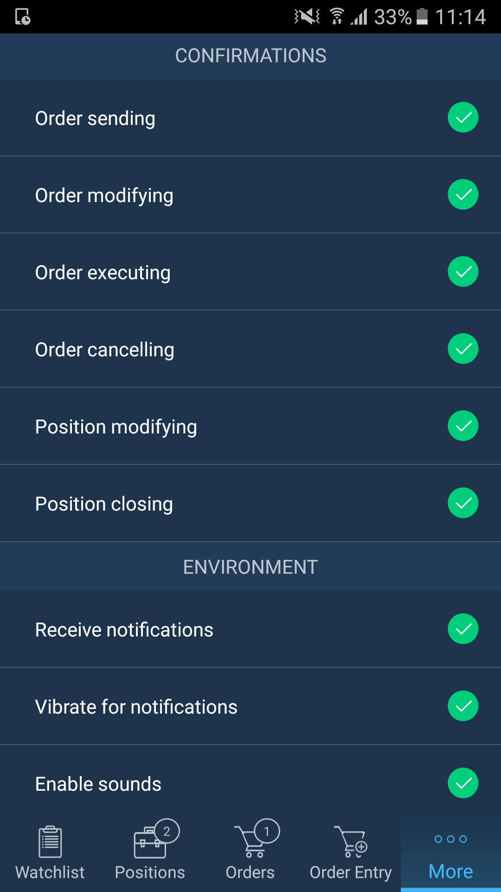
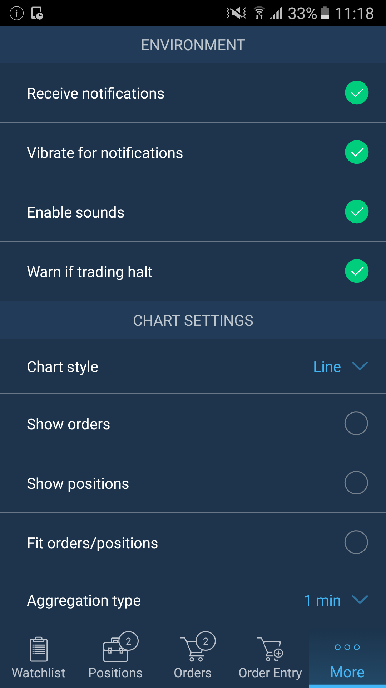
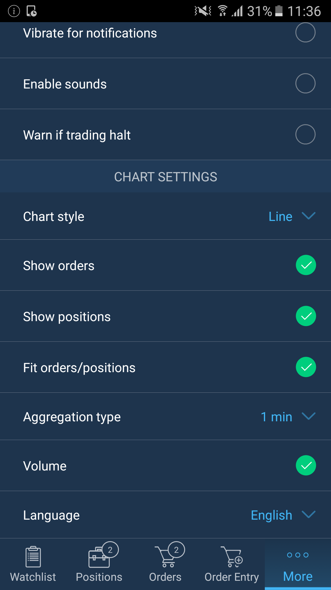

# Settings

A user can access the ‘Settings’ tab from the application’s ‘More’ menu in order to manage 'Defaults', 'Confirmations', 'Environment', 'Chart settings'.

### Defaults

In 'Defaults' settings section you can adjust the following:

* Order quantity – displays amount of lots for opening an order;
* TIF \(Time-in-force\) – allows to specify order activation time-frames by selecting among the following: Day, GTC, IOC, GTD, FOK;
* Order type – allows to select one of the following orders: Market, Limit, Stop, Stop limit, Tr. Stop;
* Quantity in lots - if checked, quantity is displayed in lots, if unchecked – in units;
* Set SL/TP values in offset – if checked, the SL/TP prices are in offset, if unchecked they are in absolute values;
* Show offset in – allows to select one of the available modes for offset displaying: Ticks, Points.

### **Confirmations**


'Confirmations' settings section allows to enable double-checking of the following actions by marking them as checked, after what the application will ask you to confirm these actions:

* Order sending;
* Order modifying;
* Order executing;
* Order cancelling;
* Position modifying;
* Position closing.

### **Environment**


In 'Environment' section you can adjust the following: 

* Receive notifications – if checked, user will receive trading notifications. The notification icon looks as follows:;
* Vibrate for notifications – if checked, the device will vibrate when notification comes;
* Enable sounds – this option shows if sounds are enabled or not;
* Warn if trading halt – if checked, user receives notifications about trading halt by symbol.

### **Chart settings**

'Chart' settings section allows to specify the following options to be visible on the chart:

* Chart style: Line, Bar, Candle, Dots, Dotted line, Histogram, Area;
* Show orders – mark as checked to visualize all sent orders;
* Show positions – mark as checked to visualize all opened positions;
* Fit orders/positions – if checked, orders/positions will be visible on the Chart that automatically scales;
* Aggregation type – allows to select representation type of data on the chart \(e.g. 1 Bar = 1 minute\);
* Volume – if checked, traded volume bars are shown on the chart.
* Language – allows to choose the language of the application.

