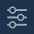

# Watchlist

The Watchlist screen is accessible by default after logging in to the mobile application.


In the Watchlist you can find information by traded symbols:

* Last price – the last trade price.
* Change – the price deviation from the current day's opening price.
* Change, % – the price deviation from current day's opening price in a percentage.

 In order to get full symbol information and open the chart, tap the Symbol name. Tap the buttonto open the Info window:

* Volume – the total amount traded today.
* Open – the day's open price.
* High – the day's highest price.
* Low – the day's lowest price.
* Previous close – the previous day's close price.

### **Symbol lookup** 

In order to open Symbol lookup, tap the button
at the top right corner of the Watchlist screen. Check/uncheck the desired symbols. Selected symbols will automatically appear in the Watchlist.

### 
**Watchlist Filter** 

In order to filter the list of displayed symbols tap the button, 
located at the top right corner of the Symbol lookup. Choose the needed exchange and symbol group from the lists of available.

### 
**Symbol menu**

Swipe left the symbol name to open the Symbol menu toolbar.                 

                                                                                                                                                                                                                                                                   

* Info – opens the Symbol info with full information about the symbol.
* Market depth – opens the level 2 quotes for the selected symbol.
* Order Entry – opens the Order entry screen for the selected symbol.
* Remove – allows removing the Symbol from the Watchlist.

### **Symbol info**

The following information is available:

1\) General:

* Symbol – name of a symbol selected in the lookup;
* Description – detailed information about a symbol;
* Exchange – information about exchange where a current symbol is traded;
* Symbol type – type of symbol traded on a market;
* Last trade date – date when a contract can be traded last time. Available for Options and Futures;
* Contract month – date of contract expiration. Available for Options and Futures;
* Close-out deadline – date when positions will be closed by a specific symbol. Available for Options and Futures;
* Delivery method – type of asset delivery. Available for Futures, Bonds, Spot, Forward instruments;
* Settlement system – T+x settlement cycle;
* Underlier – title of asset which will be delivered. Available for Options, Futures, Spot, T-Bills;
* Maturity date – a security redemption date. Available for Bonds, Forward, T-Bills;
* Face value – a security's nominal value defined in quoting currency. Available for Bonds, T-Bills;
* Coupon rate, % – a nominal interest rate for a bond, which is regulated during a bond's emission. Available for Bonds;
* Coupon cycle – periodicity of a bond yield payment to a position holder. Available for Bonds;
* Accrued interest – value of accrued interest, which a buyer will pay when buying a Bond, and a seller will get when selling a Bond. Value is indicated for 1 lot. Measured in quotting currency. Available for Bonds.

2\) Trading info:

* Symbol status – the instrument trading status, available values: Open, Closed. With the symbol status set to Closed, the instrument trading is blocked;
* Current session – information on the current trading session period for the instrument;
* Quoting currency – information about currency in which quote is calculated;
* Lot size – amount of base asset for one lot;
* Tick size – minimal change of a price;
* Tick cost – amount of base asset for one tick. Available for Futures CFDs and Futures;
* Minimal lot – the smallest part of lot for which trading is available;
* Maximum lot – the largest trade allowed in lots;
* Max position qty. – shows maximum quantity of positions per selected symbol;
* Lot step – step of lot changes;
* Allow short positions – this parameter shows if it is allowed or not to open short positions by a given instrument. Available for Equities and ETF \(Exchange traded fund\);
* High limit – maximum limit price which is set for pending orders, any price higher than the High limit is rejected. Available for Futures CFDs, Futures, Equities, Indices, Crypto and ETF \(Exchange traded fund\);
* Low limit – minimum limit price which is set for pending orders, any price lower than the Low limit is rejected. Available for Futures CFDs, Futures, Equities, Indices, Crypto and ETF \(Exchange traded fund\);
* Delivery status - status of asset delivery.
* Next holiday – the name of the next holiday and its date.
* Trading blocked on session – shows whether trading is blocked on the current session.

3\) Margin requirements:

* Margin by account – shows margin requirements based on account coefficients;
* Margin req. – shows margin requirements, which depend on the margin calculation type. When the "None" margin calculation type is selected for the instrument, the "-" is displayed;
* Buy – shows margin requirements for long positions which use different long/short margin and don’t depend on overnight margin;
* Sell – shows margin requirements for short positions which use different long/short margin and don’t depend on overnight margin;
* Day – shows day margin requirements which don’t depend on long/short margin;
* Overnight – shows overnight margin requirements which don’t depend on long/short margin;
* Initial req. – amount of margin which is necessary for trading with one lot;
* Maintenance req. – amount of margin which is necessary for keeping one lot position open;
* Overnight buy – shows coefficients of the initial and maintenance margin for the transfer of long position overnight;
* Overnight sell – shows coefficients of the initial and maintenance margin for the transfer of short position overnight.

4\) Fees:

The fee value for the fee types such as 'Fill per lot', 'Fill volume, %', 'Per fill', 'Order volume %' and 'Order per lot' can be set depending on quantity ranges.

* Fill per lot \(Buy/Sell/Short/Open/Close\) – a trader pays fee for each traded lot. Verification of Min. value withdrawal is executed for each fill;
* Per fill – a trader pays fee for each fill of an order;
* Per transaction – a trader pays fee for each transaction. Transactions: place an order, cancel an order, and modify an order;
* Per phone transaction – a trader pays fee for each transaction which was made by Phone dealer;
* VAT – a trader pays VAT from each fee operation;
* Fill volume \(Buy/Sell/Short/Open/Close\), % – fee calculated on base of the volume of each trade;
* Fill volume \(Buy/Sell/Open/Close\) with min p/d, % – commission from a volume, which ensures a day minimum in case of partial filling of an order.
* Order volume % \(Buy/Sell/Open/Close\) – a trader pays fee per each part of order volume that was filled;
* Long swap – shows the swap value applied to overnight long positions of an instrument;
* Short swap – shows the swap value applied to overnight short positions of an instrument;
* Order per lot – a trader pays fee for each traded lot. Verification of Min. value withdrawal is executed for a whole order.

Rebates:

The rebates value can be set for the fee types such as 'Fill per lot', 'Fill volume, %' depending on quantity ranges.

* Add/Remove liquidity rebate per lot – means that for each lot in an executed trade the fixed rebate value will be charged/returned \(in plan's currency\);
* Add/Remove liquidity rebate per volume, % – means that charged/returned sum will be calculated as a percent from a trade volume.

5\) Schedule

Information about settings for all trade sessions:

* Before market;
* Pre-market;
* Main;
* Post-market;
* After market.

