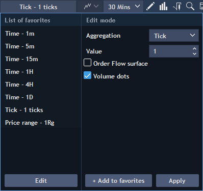

# Getting started

Logging in to the Mobile application is available via the main login screen:


Enter your valid login and password.

Check the 'Save password' if you want the app remembering your login credentials.

Select the needed language of the application interface in the drop-down list \(the list allows selecting the application interface language independently of the device system language\).

Tap the button 'Log in'.

Note: to recover the application password, tap ‘Forgot’ option in the ‘Password’ field.


  
To recover the password:

* enter Login ID in the Login field;
* enter email in the Email field;
* click Recover to receive an email with a recovery key. Then enter this key to the field.

_\*Recommended iOS version 9 or higher_

