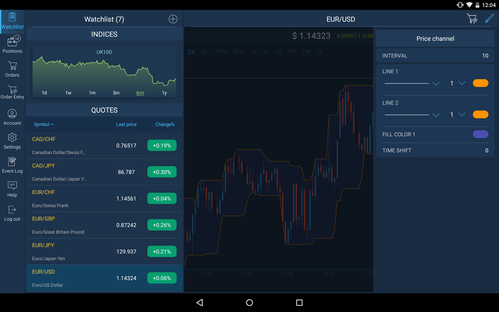
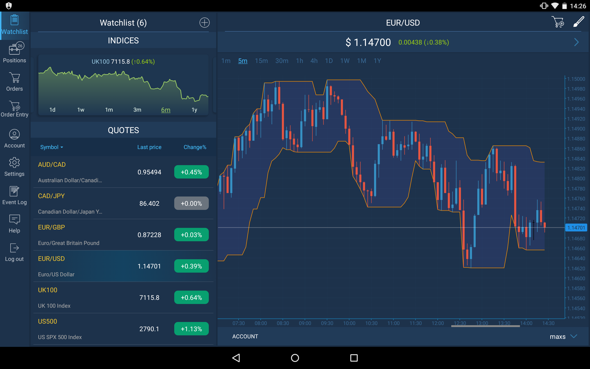
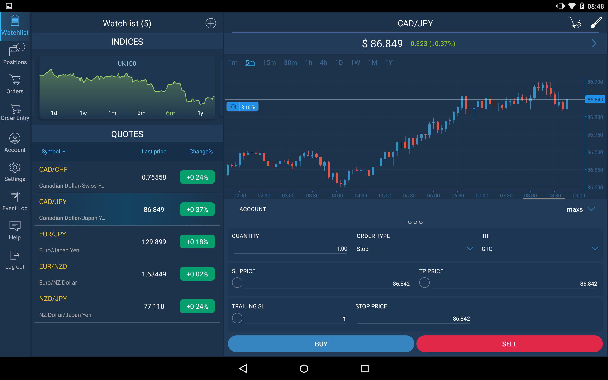

# Chart

The Chart is the most important tool for active trading and market analyzing. The Chart screen can be accessed from the main menu of the application through the Watchlist screen, and also from Orders and Positions screens.


In the ‘Indices’ section of the Watchlist swipe left or right the chart to change the symbol and choose the timeframe.

Tap the name of the symbol in the ‘Quotes’ section in order to open the chart by this symbol.

### **Chart toolbar** 

Tap the buttonto open Chart toolbar.


The Chart toolbar consists of 2 items:

* Chart style – allows to choose the style of the chart. Available chart styles: Line, Candle, Area;
* Indicators – allows to choose the needed indicator for technical analysis.

### **Indicators**

In order to add a new indicator, choose the category of indicators \(Channels, Moving averages, Oscillators etc.\) and tap the buttonnear the indicator name at the list of available Indicators.


It will appear in ‘Added indicators’ section and you can set indicator’s parameters by tapping the button. Tap the buttonlocated near indicator’s name to remove indicator from this section. 

Open the chart to see the added indicators.

### 

**Order entry**

The Order entry screen enables user to send orders. The Order entry icon
is located at the top right corner of the Chart screen.

Orders are displayed on the chart with the quantity value inside of the order marker, the color of order marker for Buy orders is blue, for Sell orders – red.

Read more information about Order entry screen here:

[https://guide.traderevolution.com/project/mobile-applications/phone/tablets/order-entry](https://guide.traderevolution.com/project/mobile-applications/phone/tablets/order-entry)

