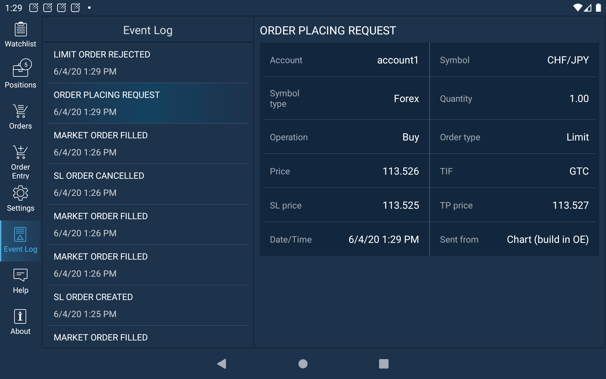

# Event log

The Event log screen shows a log of events that occurred during trading sessions. Event log is accessible through the Main menu of the platform.

Entries are logged each time a position or pending order is opened, closed or modified \(including SL and TP\). Each item indicates the action, its time and date. Tap the event in order to open full information about it.

Scroll down the Event log list in order to observe other events.

