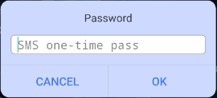

# Getting started


To log in to the application, use your valid login and password:


Check the 'Save password' if you want the app remembering your login credentials.

Select the needed language of the application interface in the drop-down list \(the list allows selecting the application interface language independently of the device system language\).

Tap the button 'Log in'.

Note: to recover the application password, tap ‘Forgot’ option in the ‘Password’ field.


To recover the password:

* enter Login ID in the 'Login' field;
* enter email in the 'Email' field;
* tap 'Recover' to receive an email with a recovery key. Then enter this key to the field.

In case you have the 'Additional verification' set up by your administrator, after tapping the button 'Log in' the following dialog window appears:                                                          

                                                                

There are three types of 'Additional verification', you can have one of them:

* SMS one-time pass;
* E-mail one-time pass;
* Fixed pass.

Enter a received or fixed code in the appropriate field and tap the button 'OK'.

_\* Recommended Android version is_ _5.0_ _and higher_

