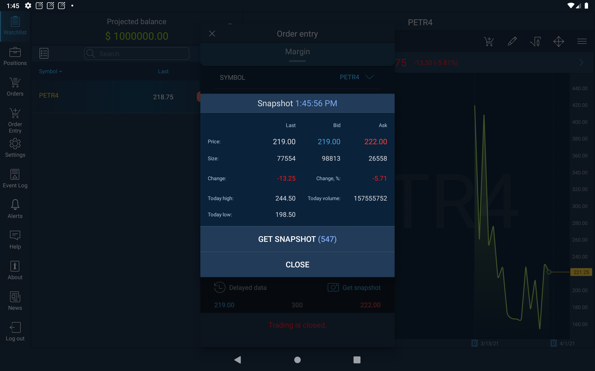
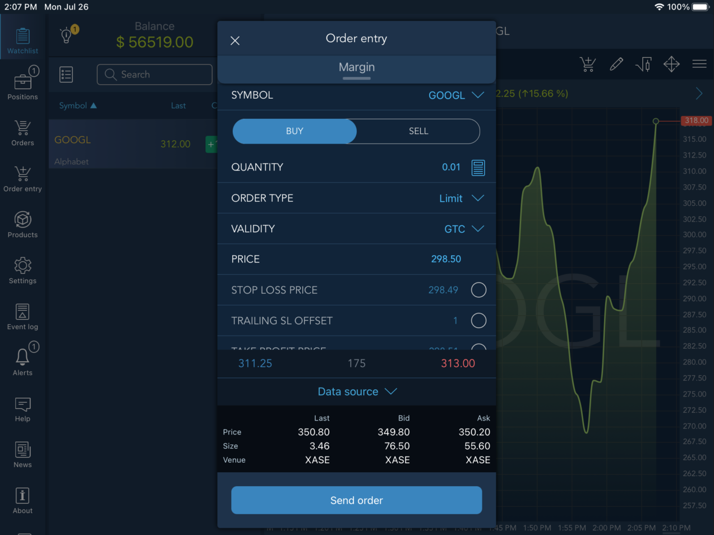

# Order entry

The Order entry screen enables user to send orders. The Order entry button
is located at the top right corner of the Chart. Also it is accessible from the main menu of the platform or from the Symbol menu. Swipe left the Symbol name in Watchlist to open Symbol menu and tap Order Entry button:

                                                               


In Order entry users can see detailed information about the traded symbol: symbol name, quantity, order type, price, Validity and information about bid and ask.

* Account – the account used for an order creation;
* Symbol – the symbol available for the trade;
* Side – allows to activate Buy or Sell side;
* Quantity – an amount of lots in which an order is placed. Tap the value in order to edit it.

**Order type:**

Order type defines the type of the order – Market, Limit, Stop, Stop limit, Trailing stop:

1. Market order guarantees execution at a market price.

2. Limit order is placed with a brokerage to buy or sell a set number of shares at a specified price or better.

3. Stop order is placed to buy or sell a security when its price surpasses a particular point, thus ensuring a greater probability of achieving a predetermined entry or exit price, limiting the investor's loss or locking in his or her profit.

4. Stop limit order will be executed at a specified price \(or better\) after a given stop price has been reached. Once the stop price is reached, the stop-limit order becomes a limit order to buy \(or sell\) at the limit price or better.

5. "Sell" trailing stop order sets the stop price at a fixed amount below the market price on the trailing offset. As the market price rises, the stop price rises by the trail amount, but if the stock price falls, the stop loss price doesn't change, and a market order is submitted when the stop price is hit. "Buy" trailing stop orders are the mirror image of sell trailing stop orders.

**Validity:**

Validity – allows specifying order validity by selecting among the following time frames: Day, GTC, IOC, GTD, FOK. This is especially important for active traders:

1. Day order, as the name implies, is valid for the current trading day.

2. GTC \(Good till cancelled\) orders, on the other hand, will remain alive until they are cancelled.

3. IOC \(Immediate or Cancel Order\) requires that all or part of the order be executed immediately after it has been brought to the market.

4. FOK \(Fill or kill\) – requires to execute the entire transaction immediately and completely or not to execute it at all.

5. GTD \(Good till date\) allows input date until which the order will be cancelled if not executed.

* SL/TP price – allows to set Stop loss and Take profit prices.
* Trailing SL offset – allows entering the order trailing stop price.

Note: SL price and Trailing SL offset cannot be checked together.

**Margin**

Swiping down the "Margin" shade located under the Order entry menu header opens the info menu with the following account parameters:

* Balance - the account balance;
* Available funds – available funds for placing new orders;
* Margin available – available margin for the trading;
* Initial margin – minimum account balance required to open a position;
* Maintenance margin – minimum account balance required to keep the position open;
* Warn. margin  – margin value, for which the warning is triggered;


When the 'Tiered price based custom coeffieicent' margin calculation type is selected for the symbol, the margin req. values are displayed for all the Tiers set


* Impact on portfolio – shows an impact of the order fill on the available funds, considering all other positions/orders;
* After trade funds – shows the available funds value remaining after filling the order:

After trade funds = Available funds + Impact on portfolio - Fee;

* Blocked for stocks – shows the amount debited from the balance in case of trading using symbols with the Stocks pre-paid margin type;
* Spread initial loss – shows initial loss on the spread:

Spread initial loss = \(Ask - Bid\) \* Tick cost \* Qty.

* P/L per Tick – displays data for Symbols:


P/L per Tick = Tick cost \* Qty - if a Symbol type is one of these: Futures, Options, Spreadbet;

P/L per Tick = Tick size \* Lot size \* Qty \* Cross-price **-** if a Symbol type is NOT one of these: Futures, Options, Spreadbet, Index;

P/L per Tick - no information for Index;

* Allow short positions – shows whether short positions opening is allowed for the symbol;

After setting all the parameters, tap the button 'Send order'.

**Get snapshot**

This button is intended to get a snapshot of the actual quotes for the current Symbol. After clicking the button, the snapshot window will be opened. The window header displays the time when the snapshot was made, and in the window itself the user can find the following data:

1. Price - displays prices for Symbol in the context of Last/Bid/Ask;
2. Size - volumes for Symbol at the specified Price in the context of Last/Bid/Ask;
3. Change - price change, calculated by the formula _Change = Last price - Previous close_;
4. Change, % - price change as a percentage, calculated by the formula _Change,% = \(Last price - Previous close\) / Previous close\) \* 100%_;
5. Today high - highest price of the day for the current Symbol;
6. Today low - lowest price of the day for the current Symbol;
7. Today volume - current day volume for Symbol.

The "Get snapshot" button allows to update the information in this window.

### Data source 

In the Order entry panel a user can see the the extended information about the source of Last, Bid and Ask prices. In order to open the table with the detailed information, tap thebutton and the widget will be shown:

