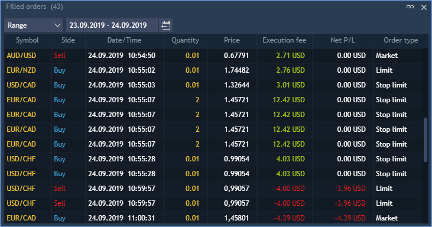

# Filled orders

Filled orders panel displays trading history. To open the Filled orders panel select Terminal -&gt; Filled orders.

The following columns are available in the panel:

* Trade ID – unique number of the trade;
* Order ID – unique number that the trading system assigns to each order. If a position is opened based on an order, the position will have the same number;
* Symbol – name of the traded instrument;
* Exposure – quantity recalculated in account currency;
* Order type – type of order;
* Symbol type – market category of the symbol \(CFD, spot, stocks, etc.\);
* Account – an account's name of a user who created an order;
* Side – type of trade \(BUY or SELL\);
* Quantity – amount of the trade;
* Price – shows price at which the order fills;
* Execution fee – commission connected with the trade;
* Gross P/L – total profit/loss of the trade;
* Net P/L – profit/losses for the symbol including commission;
* Date/Time – date and time when the operation was executed;
* Login – login of the user;
* Bought – in case of Forex: if Side = Buy, then this column shows the value of Price \* Lot size \* Qty. in base currency; if Side = Sell, then this column shows the value of Price \* Lot size \* Qty. in quoting currency. In other cases: if Side = Buy, then this column shows the value of Qty. \* Lot size – amount of bought assets \(contracts, equities\); if Side = Sell, then this column shows the value of Price \* Lot size \* Qty. in quoting currency;
* Sold – in case of Forex: if Side = Sell, then this column shows the value of Price \* Lot size \* Qty. in base currency; if Side = Buy, then this column shows the value of Price \* Lot size \* Qty. in quoting currency. In other cases: if Side = Buy, then this column shows the value of Price \* Lot size \* Qty. in quoting currency; if Side = Sell, then this column shows the value of Qty. \* Lot size – amount of sold assets \(contracts, equities\);
* Rebates – shows amount of money that was returned/paid for filling this order which added/removed liquidity;
* Expiry date – date of contract expiration;
* Product type – shows the trading mode and margin check method of the instrument;
* Strike price – price of option contract performance.

### 
**Time filter**

At the top left corner of the toolbar of the panel there is a ‘Time filter’ combo box. It allows to select time period for which a user wants to see filled orders. The following periods are available:

* Daily;
* Range – calls date menu 'From ... To' which allows to set up a desired time range. When the 'Range' period is set up, the iconappears allowing to change a time range for viewing filled orders.

