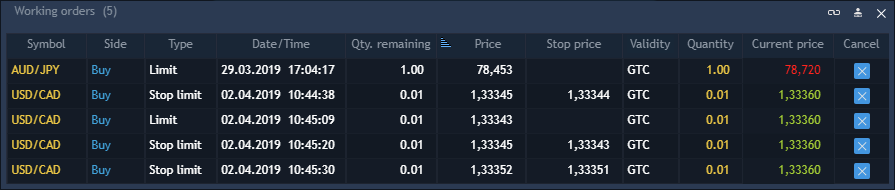

# Working orders

Working orders panel lists all created orders which are visible for a user.

To open a new Working orders panel, select Terminal -&gt; Working orders.


The following columns are available in the panel:

* Symbol – name of the instrument to be traded.
* Side – type of the trade to be performed \(Buy or Sell\).
* Date/Time – date and time when the order was placed.
* Type – the order type.
* Quantity – the order amount measured in lots or in currency units, depending on what is selected in the Settings dialog box.
* Price – price, at which the order is to be executed.
* Stop price – stop price for special stop order.
* Current price – market price obtainable from broker.
* Validity – allows specifying order validity by selecting among the following time frames: Day, GTC, IOC, GTD, FOK, GTS.
* Qty. filled – executed quantity of the order when only part of the order was executed.
* Qty. remaining – difference between quantity and executed quantity when only part of the order was executed.
* Order ID – unique number that the trading system assigns to each order. If a position is opened based on an order, the position will have the same number.
* Account – login name of the account that placed the order.
* SL price – Stop Loss price set for the order.
* TP price – Take Profit price set for the order.
* Bound to \(OCO\) – ID of the order which another order is bound to; if the former is executed, system will cancel the latter.
* Symbol type – market category of the instrument \(CFD, spot, stocks, etc.\).
* Login – login of a user.
* Symbol description – comments to the instrument.
* Exchange – indicates whether the instrument has a stock exchange or off-exchange type;
* Status – status of the current order. It can have the following values: Created, Partially filled,  Modified;
* SL offset – shows the stop loss order offset in ticks, fractional ticks or points \(depending on the current configuration of the Trading defaults section of the General settings\);
* TP offset – shows the take profit order offset in ticks, fractional ticks or points \(depending on the current configuration of the Trading defaults section of the General settings\);
* SL limit price – Limit price set for SL order;
* SL limit offset – Limit offset for SL order;
* Product type – shows the current trading mode and margin check method of the instrument;
* Strike price – price of option contract performance.
* Expiry date – date of contract expiration.
* MAM group ID – unique number of orders group. It is applicable if orders created in MAM Group.


Users can select which columns to display in the Working orders panel in the context menu of the panel.


### **Buttons toolbar**

The most important functions related to Working orders can be viewed as buttons in the toolbar of the panel. To select the buttons to be displayed, right-click on the toolbar of the panel and select the needed buttons from the menu. 

The following buttons are available:

* Cancel all – cancels all orders.
* Cancel Buy – cancels all buy orders.
* Cancel Sell – cancels all sell orders.
* Cancel Stops – cancels all stop orders.
* Cancel Limits – cancels all limit orders.
* Cancel Days – cancels all day orders \(Validity=Day\).
* Cancel GTCs – cancels all GTC orders \(Validity=GTC\).
* Cancel selected – cancels all selected orders.
* Cancel – cancels all orders by selected symbol and account.
* Modify order – allows modification of the selected order.
* Change to Market – changes order type to market for selected orders.


Clicking these buttons doesn't evoke confirmation screens, even if confirmations are enabled in the 'General settings'.


Double-click on the needed order evokes the Working order cancel window for a quick order cancelling.

### **Context menu**

The following actions can be performed via the Context menu:

* Modify order – allows modification of the selected order. 


If Stop limit order is activated, the Stop price field will be disabled in Modify screen. Thus, only Limit price can be modified. The same is true for closing Stop loss limit orders.


* Change to Market – changes order type to market for the selected orders.
* Cancel order – allows cancelling all selected orders, all orders by selected symbol, all orders by selected account, all orders.
* View – allows to show toolbar.
* Group by – allows to group orders by account, symbol, symbol type, side, type, date/time.

