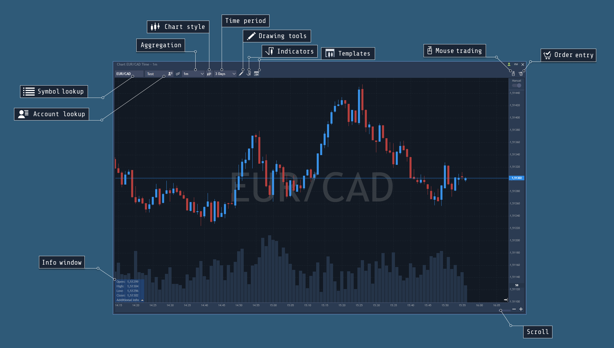

# Chart overview

Chart is the most useful panel for an active trader. Charts enable users to view quotes history, analyze market patterns, and make decisions being well-informed. 

This section describes the Chart panel and its functions.

* Symbol lookup – the field for selection of the symbol displayed on the chart.
* Account lookup – the field for selection of the account for visual trading.
* Overlays – the button for adding one chart of the symbol on the other in order to observe symbol correlations.
* Aggregation – the menu for selection of the desired aggregation type.
* Chart style – allows to select the style of the symbol price movements: candle, line, bar, dots, etc.
* Time period – the button for selection of the desired time period, etc.
* Drawing tools – the menu with drawing tools.
* Indicators – the menu with indicators.
* Chart trading – opens Chart built-in Order entry panel, which enables visual trading.
* Mouse trading – allows activating chart trading, this option is available with pressing and holding the key Ctrl as well.
* Info window – displays information about current cursor position.
* Scroll – a tool for scrolling the chart history.

To show/hide elements on Chart, right-click anywhere within the chart, select View, and check/uncheck the desired items in this section.

### **Navigation**

Users can zoom in and out on charts, scroll it horizontally and vertically, change the bar width, and manually refresh the chart.

#### **Time zooming**

To zoom in and out on the Chart panel users can use the scroll button on their mouse or simply drag the chart border in the Timeline panel using the scroll:


The scroll bar functions are similar to the scroll bar in a web browser - click, hold, and drag. Use scroll to move the data on the chart, "+" and "-" buttons to zoom in or out, and the arrow-icon to go to the last quote bar. Also, the chart can be zoomed in using the "Shift + mouse wheel" hotkey combination. Please note that in this case, not the usual zooming combination with a "Ctrl" button is used, since this button is already used for visual trading. When using this hotkey combination, zooming occurs to the mouse cursor point, that is, the chart remains centered. This feature works when the mouse cursor is over the chart.

#### **Price scale zooming**

User can zoom in or out on the chart by price scale \(vertically\). Click on the price axis, drag it up and down to scale the price axis.

#### **Scrolling the chart**

To scroll the chart horizontally, just drag the active section in the Timeline, or click inside the chart and drag it there.

For vertical scrolling the automatic scaling feature must be turned off. To do this, click the Manual zoom button on the chart or the appropriate function in the settings. This will enable vertical scrolling by clicking inside the chart and dragging it up and down.

If a user prefers Auto scale mode, he may choose fit indicators, fit orders/positions, or fit day High/Low options to be sure that all desired values are visible on the Chart that automatically scales.

#### **Refreshing the chart**

The Chart refreshes automatically. If, however, a user needs to refresh the Chart manually, right-click inside of the Chart and select Refresh. This action will reload the chart data and redraw chart.

#### **Additional options**

Right-clicking on the timeline shows the panel with additional options:

* Show time periods separators - this option displays the vertical lines on the Chart to separate different days, weeks, months and years.
* Show holes in the history - this option displays bars with no price that appears when the market is closed.

