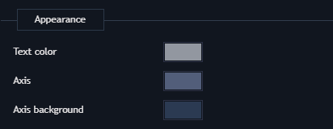
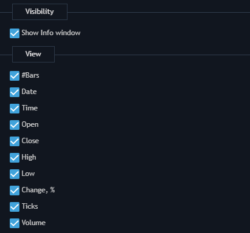

# Chart settings

Chart settings can be opened through the context menu of the Chart panel. 

### **Data style**

* Style - describes price movements of a symbol. Another way to choose the chart style through context menu: Style -&gt; \[desired style\].
* Data type - the way to accept data. Available types are: Bid, Ask, Bid/Ask average, Last. Based on server settings Last or Bid/Ask type can be disabled.
* Color settings for all styles.

### **View**

* Background colors - allows setting up color of the chart background and watermark color.
* Crosshair - allows activating and setting up cursor lines, as well as font color of price/time labels.
* Grid - allows activating and setting up grid on the chart.

* Time to next bar - allows activating and setting up color of figures that show remaining time to the next bar.
* Additional - allows activating Drawing toolbar, Scrollbar chart preview, Chart toolbar.

###  **Time scale**

* Appearance - allows setting up style of time scale.
* Holes in the history - allows seeing free space on the chart if there is no history at that moment.
* Highlight date - allows displaying separator lines for: Days, Months and Years.

### **Price scale**

* Zoom - choose between Manual and Automatic Price scale. In manual mode, changes can be made to the vertical price scale. Automatic mode is based on visible prices but it also can fit Indicators, Orders/Positions, Drawings and the day's High/Low prices.
* Scale markings - allow setting up custom grid on the price scale as well as minimal grid step, highlight grid step and highlight grid color.

* Appearance - allows setting up style of price scale.

* Highlight prices:

  * Price indicator - allows setting up active price marking as:

          - ****Scale marker

          - Scale marker with line

          - None

  * Ask price color
  * Last price color
  * Bid price color

* Spread type - allows setting up the way of spread displaying:

  * None
  * Area
  * Line \(Bid and Ask\)
  * Line with price \(Bid and Ask\)

  If spread type is None - single price indicator is shown, depending on chart data type \(Bid, Last, Ask etc.\)

* Spread area color - color of spread area \(if it's chosen as spread type\).
* Previous close line - type and color of the Previous close line.
* Day High/Low lines - type and color of the Day High/Low lines.

### **Visual trading**

* Open positions - allows displaying opened positions on chart and setting up style of lines.
* Working orders - allows displaying working orders on the chart and setting up the style of lines.
* Filled orders - allows displaying filled orders on chart.
* Bound active positions/orders to the left side - allows displaying active positions/orders on the left side of the Chart area. 

### **Chart Order entry**

This section allows selecting buttons and hot buttons which will be displayed in built-in Order entry.

### **Info window**

This section allows setting up contents of the Info window and style of its displaying.

