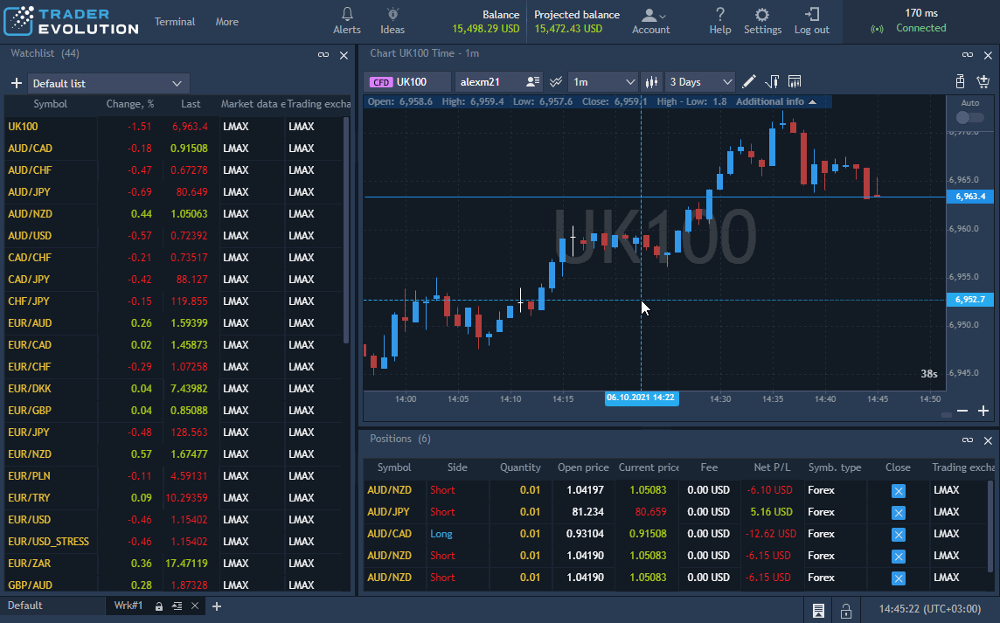
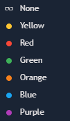
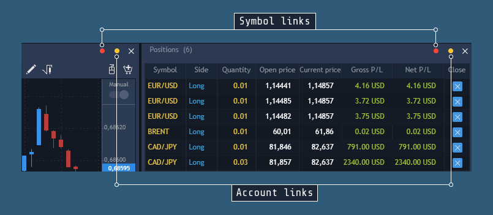

# Arranging panels

User can create own trading environment by displaying/hiding and rearranging panels. To build a workspace from scratch, click on the button
at the Status bar and blank workspace will appear. Then open the panels which will be used in the Web platform and arrange them as described below.

### **Attacjing and detaching panels**

There are two main location types for all panels:

* Attached – panel is located in some place of workspace.
* Detached – panel is located separately and can be used independently of any workspace.


Take the panel header and drag it into one of the buttons to preview it's next position, drop it when you see fit:

### 
**Creating tabbed areas**

Creating tabbed groups of panels helps save screen space and maximizes efficiency. To make a panel appear as a tab, drag it over another panel \(or tabbed area\).

### **Linking panels** 

Two types of linking are available on the header of each panel:

* **Symbol link**
  – when panels are linked, selecting a symbol in one of the panels synchronizes other panels in the group to display information relevant to that symbol. For example, when Order entry panel is linked to a Watchlist panel, the symbol displayed in the Order entry panel will be changed in accordance with the symbol selected in the Watchlist.
* **Account link**
  – available for panels which use accounts. When panels are linked, selecting an account in one of the panels synchronizes other panels in the group to display information relevant to that account. For example, when Market depth panel is linked to the Order entry panel. Account selected in Market depth panel will be used for trading through the Order entry panel.

Each link is identified by a color:

### 
**Setting up links**

To link two or more panels together:

1. Click on the link icon in one of the panels you want to link.

2. From the drop-down menu, select one of the colors. The button changes to display the color.

3. Repeat the same procedure for the other panels to be linked, selecting the same color.

To unlink a panel from a group, click the panel's link icon and select 'None'.

