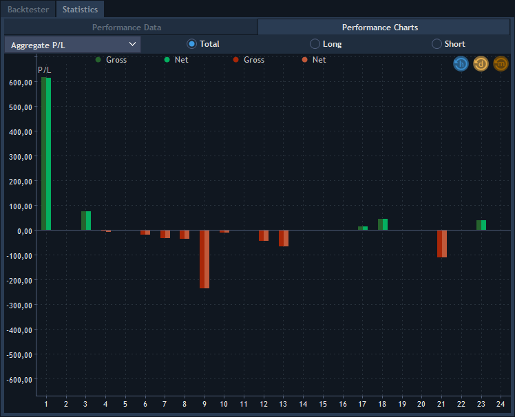

# General settings

The General settings menu is used to customize and change general properties of the Web application. To open it, click on thebutton 
at the top menu of the platform.

### **General**

* Language - defines the default language of the UI. To set up your preferred language simply select it from the list;
* Enable sounds - check to allow sound notifications.

### **View**

* Rounded average open price – check to round open price of positions in Watchlist, Positions, Filled orders, Market depth and other panels \(tick size=instrument tick size\);
* Display quantity in lots – check to view orders quantity in lots, uncheck to view in units;
* Reverse buttons order – check to reverse trading buttons into Sell/Buy pattern;
* Display absolute qty. for Sell/Short – if checked, quantity for sell orders and short positions with positive values are shown;
* Tooltips – check to display all tooltips in the application, uncheck to hide. The function is enabled by default.

### **Trading defaults**

* Account – specifies an account used by default, available for a multi-account user;
* Symbol – specifies a symbol used by default. This is the instrument that will be shown first when you load the Chart panel or Order entry panel;
* Set SL/TP values in offset \(for new orders\) – if checked, order prices are shown in offset, if unchecked – in absolute values;
* Show offset in – allows to select one of the available modes for offset displaying:

           -  Ticks;

           -  Ticks \(fractional ticks for Forex\);

           -  Points.

* Order type – allows specifying order type, available values: Market, Limit, Stop, Stop limit, Trailing stop, OCO;
* Market/Limit\(Stop limit\)/Stop TIF – allows setting up TIF for market/limit \(stop limit\)/stop orders respectively;
* Types manager – allows setting defaults.

To specify additional settings for orders you need to open 'Types manager' and select a symbol type - Forex, Futures, Equities, etc. for which you want to set up default lots values. It is also possible to override default lots values for separate symbols by adding them to the symbol types tree using "+" button. In order to apply symbol type default lots settings, just delete symbol from the tree using context menu:

* SL/TP default offset, ticks – specifies a default value of offset field for SL/TP;
* User quantity coefficient – is a default increment applied to all quantity counters;
* Price increment \(arrow\), ticks – determines the increment value \(e.g. the Limit price field in the Order entry panel\) when pressing the Up Arrow \(^\) key;
* Default lots setup – allows enabling default lot sizes for orders of selected symbol types or specific symbols which will be available in OE section.

If 'Show offset in = Ticks \(fractional ticks for Forex\)', then options 'SL/TP default offset, ticks' in the Forex instrument type will be displayed in decimal view and in the corresponding format. For example, 10 ticks will be displayed as 1.0, and 50 ticks as 5.0, depending on which value is set in the option. If 'Show offset in' is NOT 'Ticks \(fractional ticks for Forex\)', values of the options 'SL/TP default offset, ticks' are displayed by default, e.g. 10 ticks, 50 ticks.

### 
**Confirmations**


In Confirmations section all of the options are fairly intuitive:

* Confirm order placement - check if you want to confirm each order placement;
* Confirm order cancellation - check if you want to confirm each order cancellation;
* Confirm order/positions modification - check if you want to confirm each order/position modification; 
* Confirm position closing - check if you want to confirm each position closing;
* Confirm position reversing - check if you want to confirm each position reversing**.**

### **Warnings**

* Warn if wrong order – if checked, you get a warning message in case of placing order with incorrect parameters;
* Show overnight margin notification message – if checked, you will get a warning message in case if a position is transferred overnight.

If you have open positions on symbols which have overnight coefficients, you will get overnight margin notification message "Warning: on 12:49 Exchange will be closed. The margin requirements will be recalculated with the overnight coefficients before closing".

The overnight warning message shows the following items: Account \(Account for which the margin coefficients are switched to overnight\), Margin available, Maintenance margin \(based on overnight coefficients\), Overnight margin available.

Overnight margin available = Balance + all risks - Overnight total maint. req. If Overnight margin available &lt; 0, user will get a message "You don’t have enough margin for overnight, we force close some positions and cancel orders".

