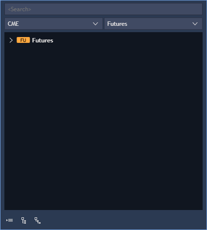

# Symbol & Account lookups

### **Symbol lookup** 

The Symbol lookup panel shows all symbols which are available through the broker. The Symbol lookup window can be opened in each panel which requires symbol selection by clicking on the button.png>). Hover the symbol name.png>)in the toolbar of the chosen panel to see this button.png>).


Click the symbol icon in the lookup of the chosen panel to open the Symbol info panel.



The Symbol lookup contains two drop-down lists with exchanges and symbols grouped according to their types, which are used on the server and available to the user. All symbols are shown in the default sequence. To filter the Symbol lookup by an exchange or symbol name, you need to select the required exchange and/or symbol type from the lists.

.png>)

.png>)


After selecting the needed value and filtering the items all symbol tabs that don't match the filter will be hidden from the list.


Select 'All' in the drop-down exchange and types lists in order to cancel the filtering and view all symbol tabs.

If symbol name in the symbol lookup window is entered from the keyboard, then all symbol groups containing symbols with matches in their names are expanded.

For easy management of the lookup, it has three buttons and link located in the bottom of the tab: 

* Collapse all
  \- allows to collapse all opened tabs to the form that shows only exchanges in the lookup tree.
* Expand exchanges
  \- allows showing exchanges and symbol types in the lookup tree.
* Expand types
  \- allows showing exchanges, symbol types and symbols in the lookup tree.

All symbols are grouped according to categories: Equities, Forex, Futures, etc. The Symbol lookup window displays information as follows: exchange, symbol type and icon, symbol group, symbol, contract or strike price (for Futures and Options).


You can search for symbols and filter them by their localized names if they were assigned localized names in one or several supported languages on the server. To do that you need to select the corresponding language for the application user interface and enter the localized name of the sought instrument/instruments in this language. With that, for all the symbols in the lookup, their localized names and descriptions (if there are any) will be displayed as names and descriptions accordingly when the corresponding interface language is selected. The same principle applies to the display of instrument names in Chart, Market depth, Order entry, Matrix, Super DOM (depth of market), Scalper, Symbol info, Aggressor balance, Saved orders panels as well as Positions, Working orders, Orders history, Filled orders, Positions balance panels.


If there is no localized name for an instrument for the current interface language, the server instrument name and description are displayed.

For Options the detailed symbols' information (description) is also available in the lookup:

### **Account lookup** 

The Account lookup displays all accounts available for the user. The Account lookup panel can be opened in each panel which requires account selection by clicking on the button.png>)
next to the account scroll down menu.

.png>)


All Accounts are sorted on base of "User group -> User" hierarchy. User can hide any accounts which belong to specific User or User group.
