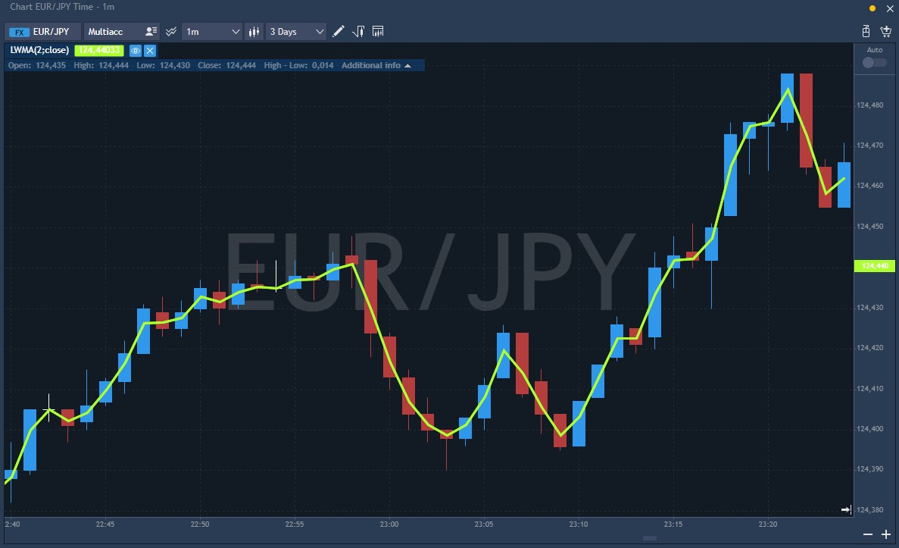

# LWMA \(Linear weighted moving average\)

Linear Weighted Moving Average is a type of moving average that just like the exponential moving average assigns a higher weighting to recent price data but makes it easier and more pronounced. This average is calculated by taking each of the closing prices over a given time period and multiplying them by a predetermined “weight” coefficient. Once the position of the time periods has been taken into account, they are summed up and divided by the sum of the number of time periods.

The Linear moving average is less inert than the Simple moving average. When comparing Exponential moving average, it considers fewer bars and does not depend on the previous value, so when applied to the same prices, it will always show the same value, regardless of how much data is preloaded. On the other hand, the linear weight makes the line sharper than other moving averages, so it produces more "noise" in a flat market.

The Linear weighted moving average is used just like EMA, most traders use LWMA in conjunction with a simple moving average. Buy and sell signals can be generated during breakouts and crossovers of moving averages. Trends are confirmed when SMA and LWMA move in the same direction.

### Calculation

In the case of the weighted moving average, the latest data is of more value than the earlier data. The Weighted moving average is calculated by multiplying each closing price of the series by a certain weight coefficient:

LWMA = SUM \(CLOSE \(i\) \* i, N\) / SUM \(i, N\)

Where:

SUM — sum;

CLOSE \(i\) — current close price;

SUM \(i, N\) — total sum of weight coefficients;

N — smoothing period.

### Main parameters 

*  Period of Linear weighted moving average – the number of periods involved in the indicator, 9 by default;
*  Sources prices for MA –  price type at which the indicator will be calculated. Available values: Low, Open, High, Close, Typical, Medium, Weighted.

This indicator looks as follows on the chart:

